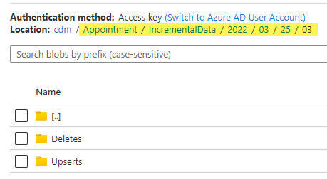

# Cleaning up Customer Insights Data (ADLS Connector)
Customer Insights is commonly a component in Patient Outreach solutions on the Microsoft Cloud for Healthcare platform. Removing test or bad data from Dataverse is required after a test cycle (In the same way it is in FHIR). 

When data is being [ingested into Customer Insights from Azure Data Lake Storage](https://learn.microsoft.com/en-us/dynamics365/customer-insights/connect-common-data-model), there are a few options for clean up of data.

## Understanding Incremental Processing in a CI ADLS Data Source

When an ADLS data source in Customer Insights is configured for [incremental refreshes](https://learn.microsoft.com/en-us/dynamics365/customer-insights/incremental-refresh-data-sources), then the directory structure in the linked container will look like the below:

In this example, the name of the ADLS container is _cdm_.
* Each entity being ingested into Customer Insights will have its own directory inside the container, such as _Appointment_
* Each entity directory will contain an _IncrementalData_ directory
* Each _IncrementalData_ directory contains date/time hierarchy directories of the format _yyyy/mm/dd/hh_
* Each _hh_ directory will have folders for _Deletes_ and _Upserts_ 

Each time time this data source is refreshed in Customer Insights, all directories and their files created since the last refresh will be processed. Data in the _Upserts_ folders will be upserted into the Customer Insights data set, and data in the _Deletes_ folders will be removed from the Customer Insights data set. 

## Delete Select Data Through Incremental Deletes

When specific data sets need to be deleted out of a Customer Insights data source processed from an ADLS container, if the data source in Customer Insights is configured for [incremental refreshes](https://learn.microsoft.com/en-us/dynamics365/customer-insights/incremental-refresh-data-sources), data that should be removed from Customer Insights should be placed in the _Deletes_ folder in the ADLS container. 

The schema of each delete file should be the same as that of the upsert files (files that are processed as incremental data). All attributes in the files should have non-null and non-empty values. If necessary, default values can be used listed by data type below:
* String: "-" 
* Integer: 0 
* Float: 0.0 
* DateTime: 1/1/1970 12:00:00 AM +00:00 
* Boolean: false

The easiest way to ensure proper formatting is to copy or move the original CSV files containing the processed data from its source _Upserts_ folders into _Deletes_ folders for dates that have not yet been processed. The timestamps of the files must also be after the last refresh date. 

For instance, if there was an issue with a recent data sync, or you need to re-run a test, which requires you delete all data in an _Encounter_ entity loaded into the container yesterday:

1. Create a new datetime hierarchy folder for today if it doesn't yet exist, and create _Upserts_ and _Deletes_ directories inside
2. Browse into the _/Encounter/IncrementalData/[datetime hierarchy for yesterday]/Upserts_ directory
3. Copy or Move all CSV files into the _Deletes_ directory for today, ensuring the timestamps of these files are after the last refresh time of the data source in Customer Insights
4. Refresh the data source in Customer Insights

> IMPORTANT: 
> For optimal performance, Customer Insights recommends the size of a partition be 1 GB or less and the number of partition files in a folder must not exceed 1000.   
> When deleting large sets of data, ensure the size of each _Deletes_ folder is less than 1GB, and the number of CSV files in a folder does not exceed 1000.

## Delete Everything & Re-Initialize the Data Source
When all data must be cleared out of an ADLS data source configured for [incremental refreshes](https://learn.microsoft.com/en-us/dynamics365/customer-insights/incremental-refresh-data-sources), care must be taken to preserve the container structure, and the data source in Customer Insights must be forced to reset the incremental behavior with a Full Load first. 

1. Browse into each Entity folder
2. In _FullData_ folder, delete data - but leave the _FullData_ folder in tact
3. In _IncrementalData_ folder, delete all date/time hierarchy folders and all data contained in them - but leave the _IncrementalData_ folder in tact
4. Ensure none of the _*.cdm.json_ files are removed from any of the directory levels
5. Place any initial data files in the _FullData_ folder of each entity

> Note: at the time of this article, at least one file with one record must exist in the _FullData_ folders for the entities to be initialized

6. Edit the data source in Customer Insights and force it to perform a Full Load. 

## Resources
* [CI: Connect to data in Azure Data Lake Storage](https://learn.microsoft.com/en-us/dynamics365/customer-insights/connect-common-data-model)
* [CI: Configure Incremental Refresh for ADLS data sources](https://learn.microsoft.com/en-us/dynamics365/customer-insights/incremental-refresh-data-sources#configure-incremental-refresh-for-azure-data-lake-data-sources)
* [The Common Data Model Manifest](https://learn.microsoft.com/en-us/common-data-model/sdk/manifest)
