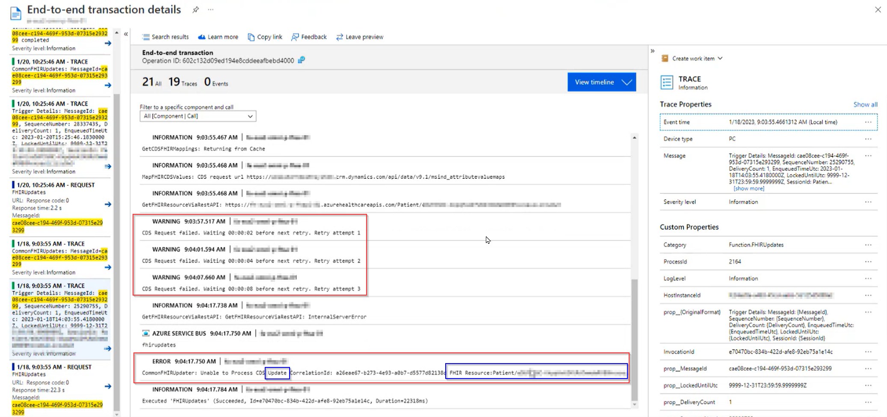
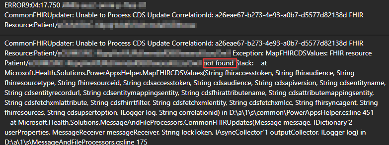

# FHIR Sync Agent - Common Errors
This document builds on the [FHIR Sync Agent (to Dataverse) Background (Monitoring)](SA_Monitoring.md) document. Please review that first.

Here, we will review some common issues and discuss next steps.

## Updates are not found in Dynamics
The issue that we saw in [FHIR Sync Agent (to Dataverse) Background (Monitoring)](SA_Monitoring.md) looked like this.

Upon detailed review of the error entry...

...you will see that the patient wasn't found in Dynamics. 

Next steps:
* Is the patient truly missing from Dyanmics
* Determine when the patient should have been created in dynamics. 
    * Was there an error during that flow? 
    * Are there corresponding Dynamics logs that can help?
    * If the create should have been processed by the Sync Agent, find the original submission following similar steps to [FHIR Sync Agent (to Dataverse) Background (Monitoring)](SA_Monitoring.md)

## Creates when the record exists
A similar scenario is an attempted create when the patient already exists. 

Next steps:
* Is this occuring because of the resubmission of a message?
    * If so, can this error be ignored?
* Is there another way that the patient was created in Dynamics?
    * If so, which record is most up-to-date?
    * Can the changes be made manually to Dynamics?
    * Can the Sync Agent message be changed from 'Create' to 'Update' and resubmitted?
