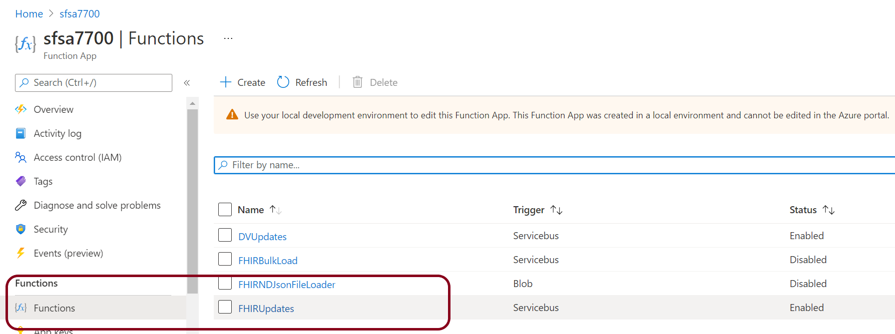
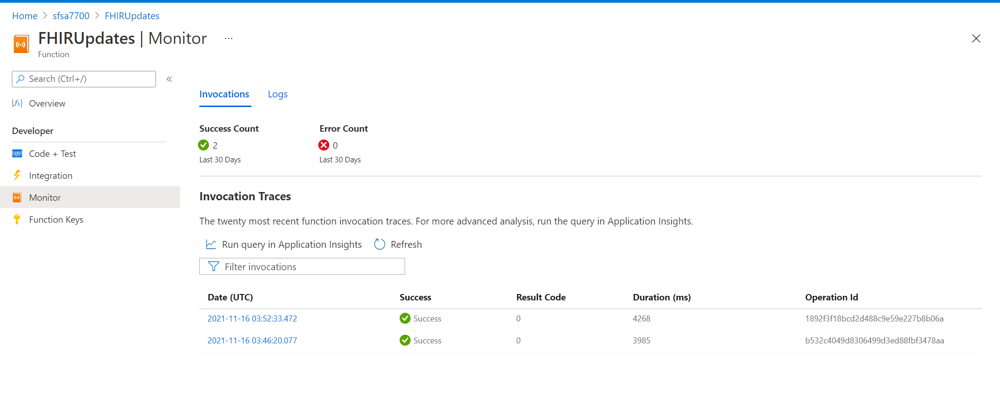
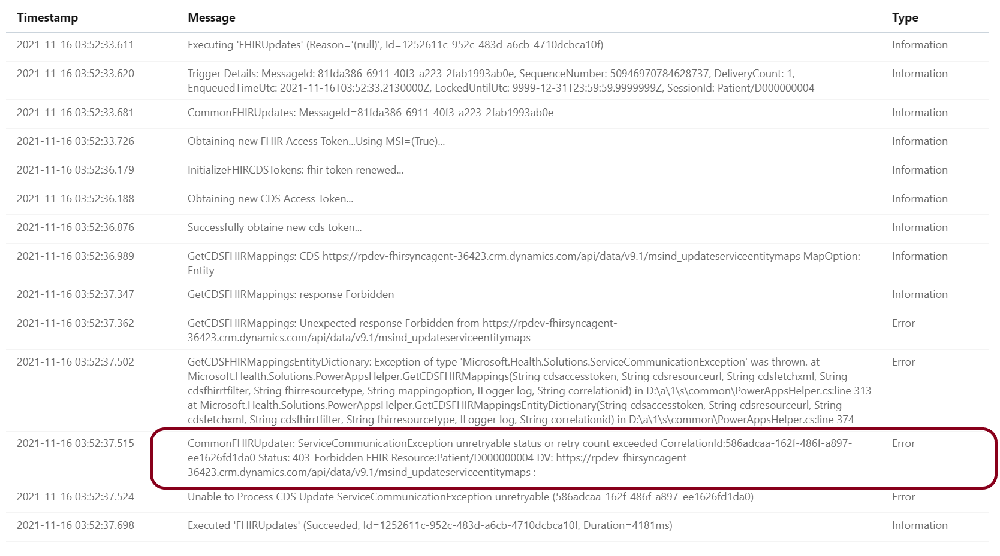
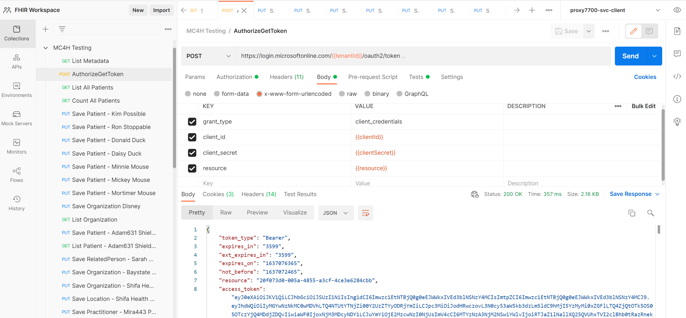
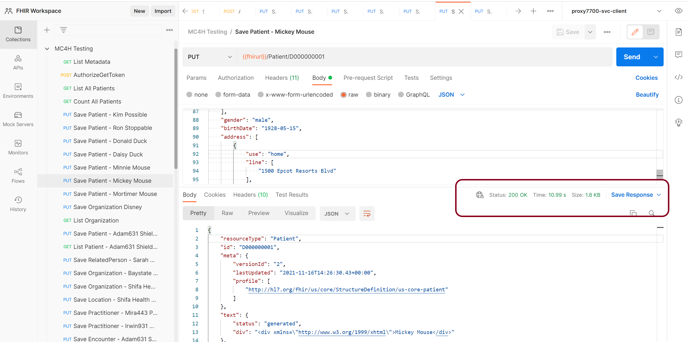
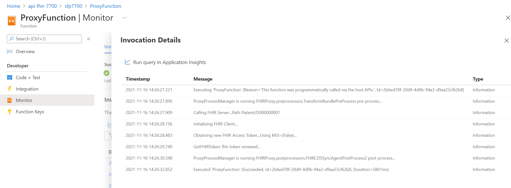
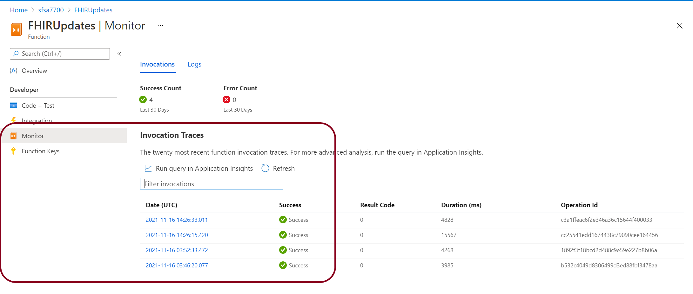
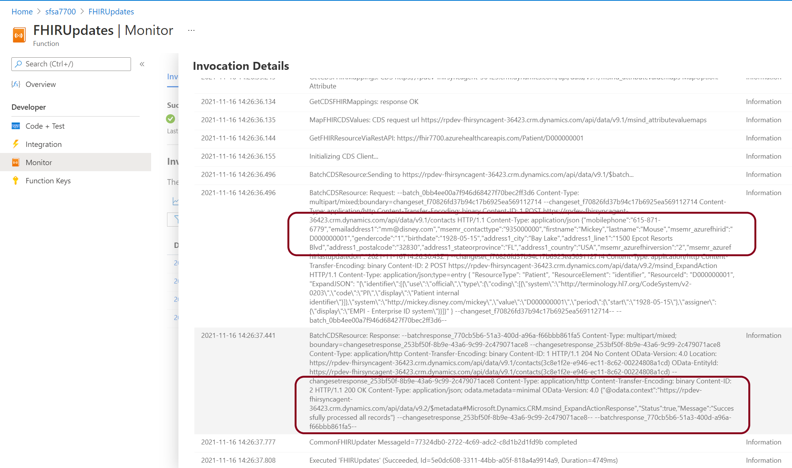

# FHIR Sync Agent (to Dataverse) Background 
The FHIR Sync Agent is a Function App delivered by Microsoft as a part of the Microsoft Cloud for Healthcare (MC4H) to help syncronize data between an Azure FHIR Server and Dataverse. The FHIR Sync Agent relies on both app configurations in Azure as well configurations and mappings defined in the MC4H Data Integration Toolkit app (previously called Sync Admin for FHIR).

Resources: 
* [FHIR Sync Agent Overview](https://learn.microsoft.com/en-us/dynamics365/industry/healthcare/sync-agent-overview)
* [FHIR Sync Agent Dataverse Configuration](https://learn.microsoft.com/en-us/dynamics365/industry/healthcare/sync-agent-dataverse-configuration)
* [Data Integration Toolki Overview](https://learn.microsoft.com/en-us/dynamics365/industry/healthcare/data-integration-toolkit-overview)

The purpose of this article is to share specific tips and queries to help monitor the Sync Agent for errors that may occur on the processing of individual records into Dataverse.

# Tracing with Postman and Function Monitor
The best method for testing FHIR to Dataverse is to start with Postman.  **Remember** data that is in FHIR will not automatically be sync'd to Dataverse once an Entity is enabled; rather, the data must be *created* or *updated* in the FHIR server to trigger a sync. This is due to the trigger function in the FHIR-Proxy:

* FHIR data enters the FHIR-Proxy either via Bundle or HTTPS
* The FHIR-Proxy performs any Pre-Process task (ie converting a Transaction Bundle into a Batch Bundle)
* The FHIR-Proxy Post-Process _FHIRProxy.postprocessors.FHIRCDSSyncAgentPostProcess2_ send the MSG and Patient ID to the FHIR-SyncAgent for processing
* The FHIR-SyncAgent calls the Dataverse API with the FHIR resource for processing 

## Optional: Enable Detailed Send & Receive Logging

> WARNING:<BR> Enabling this logging is meant for dev environment with fake or de-identified patient data only. This additional logging will include the FHIR bundle contents in logs, which contains patient data. This would be a compliance violation if used in upper environments containing real patient data. Ensure this setting is always set to false in environments with real patient data.

The following application setting in the FHIR Sync Agent Function App can be used to enable detailed Send and Receive logging, to aid in testing and troubleshooting in lower environments:

| App Setting Name  | Value   | Purpose   |
|-------------- | -------------- | -------------- |
| SA-LOGREQRESP  | True     | Enables detailed send and receive logging    |

Once Enabled, you will be able to view detailed logging information at:

_Azure Portal -> Function App -> Functions -> FHIRUpdate (update to Dataverse)_



_-> Functions -> Monitor_



In the example below, you can see a 403-Forbidden response from Dataverse. This tells us that the application ID we are using is un-authorized to write to Dataverse. 



> **NOTE ON A COMMON QUESTION** <BR>
**Q:** Why does the monitor show Success even though there is an error in the file?  
**A:**  Technically the connection was a success. We sent a package and received a reply. Therefore the communication is deemed successful even through it may not have included the result you wanted.

## Test Steps
A collection of example FHIR calls useful for testing in Postman with sample patient data can be downloaded here: [MC4H Testing.postman_collection.zip](./Samples/MC4HTesting.postman_collection.zip)

The Patient Data in the MC4H Testing collection is structured in a way to help you track the users you create by ID. In this example we are creating a Patient with a known ID that we can track.

```al
PUT {{fhirurl}}/Patient/D000000001
```
The JSON for Patient D000000001 is in the body of the Postman message (shortened for readability)

```al
{
    "resourceType": "Patient",
    "id": "D000000001",
    "meta": {
        "profile": [
            "http://hl7.org/fhir/us/core/StructureDefinition/us-core-patient"
        ]
    }
...
}
```

First, obtain a new Token from AAD



Select a Patient to test with - note the Patient ID - ensure you have a 200 OK return message from FHIR-Proxy 




Check the Post Processor in FHIR-Proxy to ensure that it was successful 




Check the FHIRUpdates Monitor 



Here you can see the detailed bundle contents (if enabled by SA-LOGREQRESP setting), which can be helpful in troubleshooting mapping issues, and the 200 response.



# Common Errors and Resolutions

# Querying for Errors Logged to Application Insights