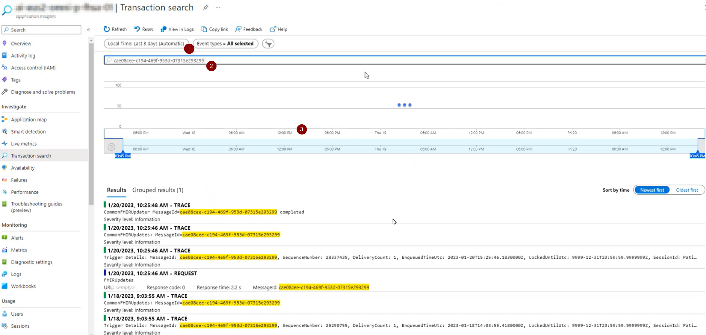
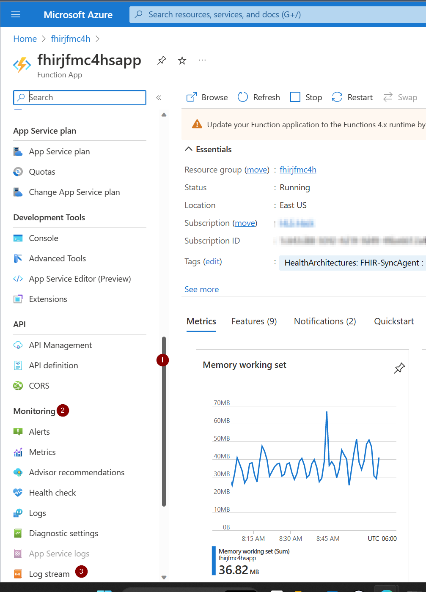

# FHIR Sync Agent (to Dataverse) Background 
The FHIR Sync Agent is a Function App delivered by Microsoft as a part of the Microsoft Cloud for Healthcare (MC4H) to help syncronize data between an Azure FHIR Server and Dataverse. The FHIR Sync Agent relies on both app configurations in Azure as well configurations and mappings defined in the MC4H Data Integration Toolkit app (previously called Sync Admin for FHIR).

Resources: 
* [FHIR Sync Agent Overview](https://learn.microsoft.com/en-us/dynamics365/industry/healthcare/sync-agent-overview)
* [FHIR Sync Agent Dataverse Configuration](https://learn.microsoft.com/en-us/dynamics365/industry/healthcare/sync-agent-dataverse-configuration)
* [Data Integration Toolki Overview](https://learn.microsoft.com/en-us/dynamics365/industry/healthcare/data-integration-toolkit-overview)

The purpose of this article is to share specific tips and queries to help monitor the Sync Agent for errors that may occur on the processing of individual records into Dataverse.

# Tracing with Postman and Function Monitor
The best method for testing FHIR to Dataverse is to start with Postman.  **Remember** data that is in FHIR will not automatically be sync'd to Dataverse once an Entity is enabled; rather, the data must be *created* or *updated* in the FHIR server to trigger a sync. This is due to the trigger function in the FHIR-Proxy:

* FHIR data enters the FHIR-Proxy either via Bundle or HTTPS
* The FHIR-Proxy performs any Pre-Process task (ie converting a Transaction Bundle into a Batch Bundle)
* The FHIR-Proxy Post-Process _FHIRProxy.postprocessors.FHIRCDSSyncAgentPostProcess2_ send the MSG and Patient ID to the FHIR-SyncAgent for processing
* The FHIR-SyncAgent calls the Dataverse API with the FHIR resource for processing 

## Optional: Enable Detailed Send & Receive Logging

> WARNING:<BR> Enabling this logging is meant for dev environment with fake or de-identified patient data only. This additional logging will include the FHIR bundle contents in logs, which contains patient data. This would be a compliance violation if used in upper environments containing real patient data. Ensure this setting is always set to false in environments with real patient data.

The following application setting in the FHIR Sync Agent Function App can be used to enable detailed Send and Receive logging, to aid in testing and troubleshooting in lower environments:

| App Setting Name  | Value   | Purpose   |
|-------------- | -------------- | -------------- |
| SA-LOGREQRESP  | True     | Enables detailed send and receive logging    |

Once Enabled, you will be able to view detailed logging information at:

_Azure Portal -> Function App -> Functions -> FHIRUpdate (update to Dataverse)_


_-> Functions -> Monitor_


In the example below, you can see a 403-Forbidden response from Dataverse. This tells us that the application ID we are using is not authorized to write to Dataverse. 


> **NOTE ON A COMMON QUESTION** <BR>
**Q:** Why does the monitor show Success even though there is an error in the file?  
**A:**  Technically the connection was a success. We sent a package and received a reply. Therefore the communication is deemed successful even through it may not have included the result you wanted.

## Test Steps
A collection of example FHIR calls useful for testing in Postman with sample patient data can be downloaded here: [MC4H Testing.postman_collection.zip](./Samples/MC4HTesting.postman_collection.zip)

The Patient Data in the MC4H Testing collection is structured in a way to help you track the users you create by ID. In this example we are creating a Patient with a known ID that we can track.

```al
PUT {{fhirurl}}/Patient/D000000001
```
The JSON for Patient D000000001 is in the body of the Postman message (shortened for readability)

```al
{
    "resourceType": "Patient",
    "id": "D000000001",
    "meta": {
        "profile": [
            "http://hl7.org/fhir/us/core/StructureDefinition/us-core-patient"
        ]
    }
...
}
```

First, obtain a new Token from AAD


Select a Patient to test with - note the Patient ID - ensure you have a 200 OK return message from FHIR-Proxy 


Check the Post Processor in FHIR-Proxy to ensure that it was successful 


Check the FHIRUpdates Monitor 


Here you can see the detailed bundle contents (if enabled by SA-LOGREQRESP setting), which can be helpful in troubleshooting mapping issues, and the 200 response.


# Historical: Querying for Errors Logged to Application Insights over a specific time range
The Sync Agent is a backend process. It is often easiest to look at logs that have occurred in the past to find an issue.

One way to view historical logs is through Application Insights.

1. Navigate to your resource group (in this case fhirjfmc4h)
1. Filter the resources using the letters 'sa' (for sync agent). 
1. Find and select the Application Insights instance.


1. Click search


1. To change the default time period, click "Local Time: Last 24 hours (automatic)"
1. Customize the time period
    * Choose a time period where you expect to see the error. This can be customized to any period in the past as long as your logs are retained. (see red box)
    * Ensure that you are viewing times in your local timezone (see blue box)
1. Click apply

This will likely result in a large list of log messages


If that's all you know, that's how you will have to find the related log messages.

Ideally, if you have an id or a specific string that may be in a log, your search can focus on that.


1. Like above, choose the time period that you expect the log (be sure to pay attention to time zones)
1. Type / paste the string in the search bar. 
1. Press [Enter]

The above case is a search for a Service Bus MessageId pulled from Service Bus Explorer. But, it can be any string you'd expect to be in the log. This gives us a reasonably short list to review. 

Review any Exceptions first, then Requests and lastly Traces. Traces are usually quite verbose and require you to follow the flow to get enough  context. 

In our example above, we have just requests and traces. Let's look at a request.


The request gives context in the property list on the right (1), including the SessionId (2) which is in the format: Patient/[PatientId]

We can look at the neighboring traces to see more information. The ones that are longer probably have more information. In this session, we clicked on the Trace at the bottom of the current view (3).


This gives us the information we needed. We see that there are warnings and an error listed. Here we see that this was an update operation on Dataverse (see blue box), we also know the patient that is having the problem. 

Next steps would be to look into dataverse and understand what's going on with this patient and possibily any corresponding logs.


# Real-time: Viewing logs as they happen
Sometimes it is easier to isolate an issue if you can repeat the issue, then watch the logs as they happen.

To do this, first navigate to your Sync Agent.


1. Navigate to your resource group (in this case fhirjfmc4h)
1. Filter the resources using the letters 'sa' (for sync agent). 
1. Find and select the Function App


1. Scroll the menu on the left 
1. Under Monitoring 
1. Choose Logs


You will see a connecting message for a few seconds


You will then see an active log stream. 
1. You can adjust the severity level to Verbose (all messages) to Error (fewest messages)

Invoke the action that is causing the issue you are interested in, then watch the stream. Some ways to accomplish this are:
* Re-submitting the message in the service bus (see [Reprocessing Dead-Lettered Messages](SA_ReprocessDeadLetter.md))
* Performing a  FHIR add or update from Postman (see [Adding a Patient](FHIR_NewPatient.md))

## Next steps...
* [Common Sync Agent Errors](SA_Common_Errors.md)
* [Create an alert based on a query](SA_Monitoring_Configure_Alert.md)
