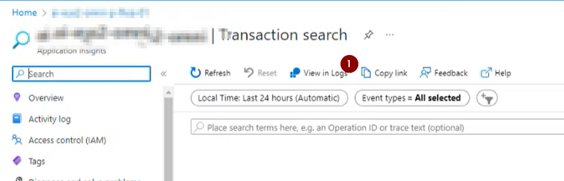
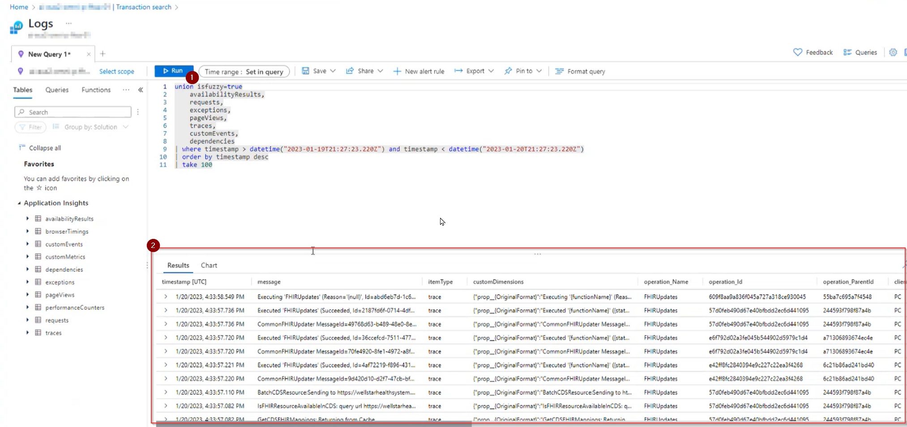
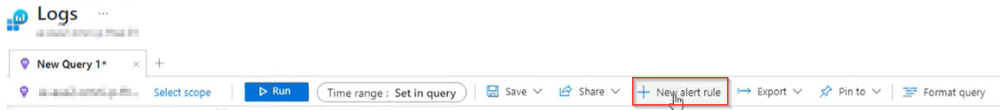
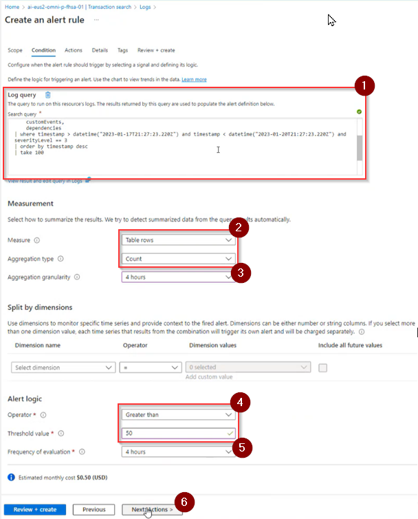
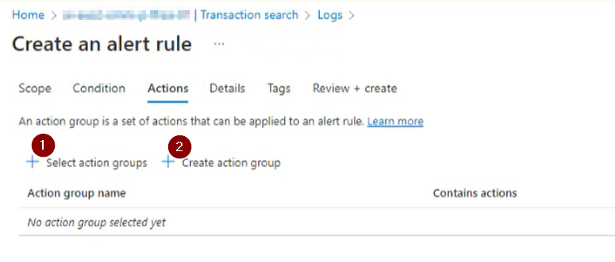
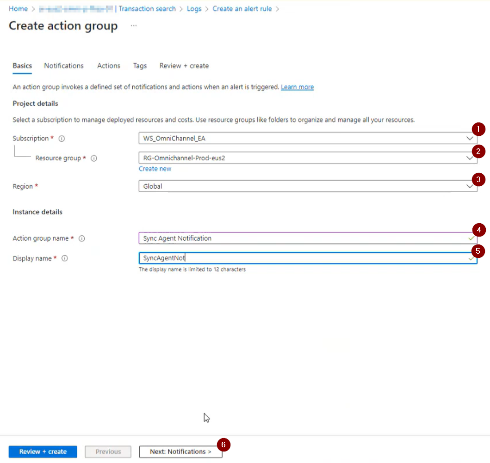
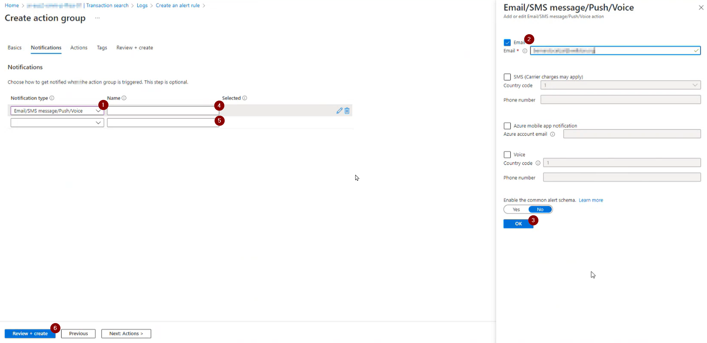
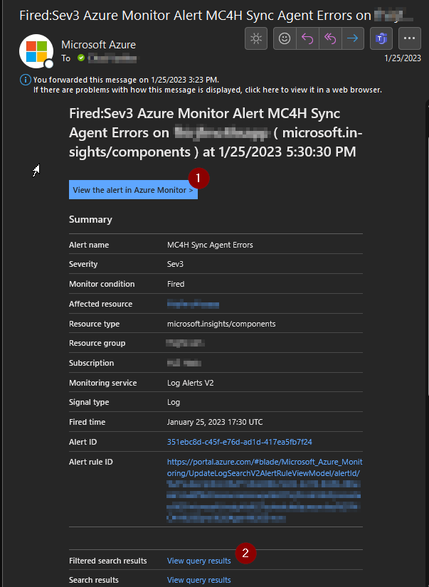

# Create an alert based on a query
See [FHIR Service Agent Monitoring](SA_Monitoring.md#historical-querying-for-errors-logged-to-application-insights-over-a-specific-time-range) for the steps to query Sync Agent for issues. You may want to be notified of similar failures in in the future. 

Start with the Application Insights transaction search from before, then
1. Choose 'View in Logs'

This will bring you to the Log Analytics view of the same log stream with a query already built.

1. Click on 'Run'
1. This will return a similar list to what we saw in Application Insights

Log Analytics uses Kusto Query Language (KQL). A good resource syntax is [Kusto Query Language (KQL) overview](https://learn.microsoft.com/en-us/azure/data-explorer/kusto/query/).

In our example, we wanted the query to run once every 4 hours and send a notification if there are more than 50 errors during that period. To accomplish this, a few adjustments to the query should be made:
We are going to make a few ajustments to the query.

    union isfuzzy=true
        availabilityResults,
        requests,
        exceptions,
        pageViews,
        traces,
        customEvents,
        dependencies
    | where timestamp > ago(4h) and (itemType == 'exception' or severityLevel >= 3)
    | order by timestamp desc

* We want the timerange to be relative to when the query is run. We set it to look at the last 4 hours since that's the desired timeframe of our alert.
* We want to look for either exceptions or other log entries that are severityLevel 3 or greater. ([additional severityLevel info here](https://learn.microsoft.com/en-us/dotnet/api/microsoft.extensions.logging.loglevel?view=dotnet-plat-ext-3.1))

Once you have your query built, we need to create an alert rule to trigger on a regular basis.

1. Click 'New Alert Rule'

[More detail on creating alert rules can be found here](https://learn.microsoft.com/en-us/azure/azure-monitor/alerts/alerts-create-new-alert-rule?tabs=metric)

1. You will see that the query we created has been pulled forward
1. The alert notifications will occur based on counting the number of rows the query returns
1. We want our rule to run once every 4 hours, so #3 and #5 are both set to 4 hours
1. We chose to get  notifications if the number of rows are greater than 50
1. Same as above, set this the same as #3, the frequency you'd like the rule to run
1. Once finished, click to define the actions to be run

Next, we will create an action group... this will be a collection of notification targets. This collection can be reused on other alerts.

1. 'Select action groups' if you have an existing group
1. 'Create action group' if you need to create a new one

1. Keep the default Subscription (which should be where the resource is located)
1. Keep the default Resource Group (which should be where the resource is located)
1. Allow this group to be used across Azure regions
1. Give this group a meaningful name
1. Give this group a meaningful display name
1. Click next

1. Choose Email/SMS/Push/Voice notification type
1. Choose the delivery mechanism and the email address / phone number
1. Click ok to save the destination
1. Give this destination a name (likely the name of the person)
1. Repeat 1-4 for additional members of this notification group
1. Click 'Review + Create'

Finally...
* Review the action group summary and click Create
* Review the summary of the alert rule and click Create

When / if the alert is triggered, you will receive a notification 

It contains a number of links that can bring you directly to
1. The configured alert
1. The filtered search results that generated the alert

