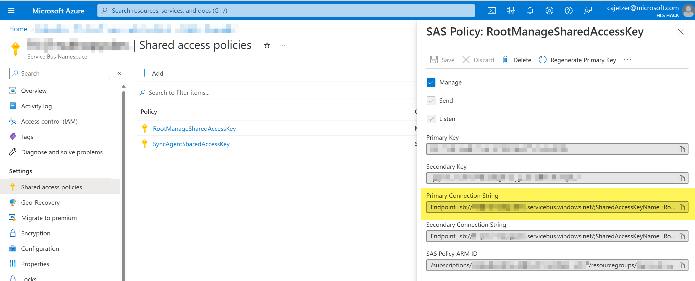
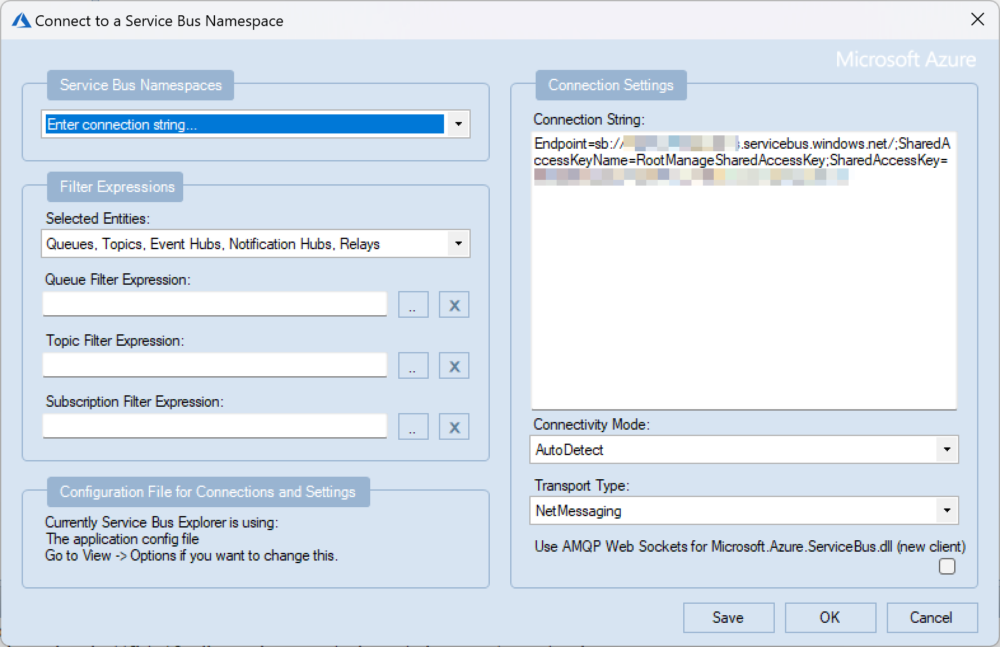
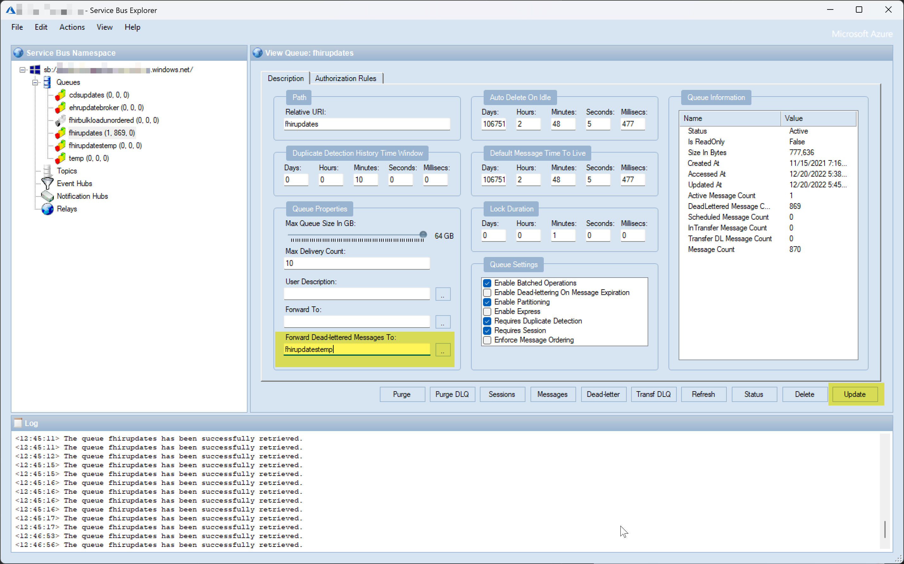
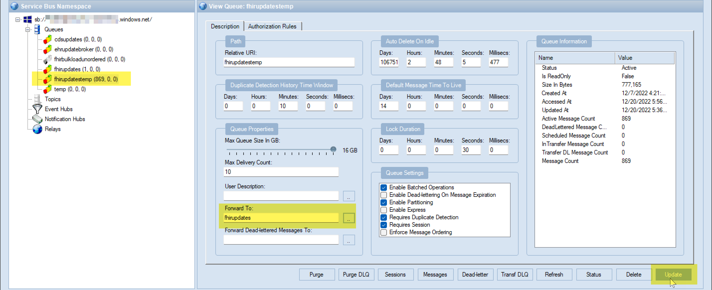

# Reprocessing Dead-Lettered Messages in Bulk (Azure Service Bus)

When Azure Service Bus is used for queuing and delivering messages to listening processes or applications, the dead-letter queue (DLQ) can be used to land messages in that fail to be processed successfully by the listener. This way, these messages are not lost and can be replayed after mitigating the failures.

**References:**
* https://learn.microsoft.com/en-us/azure/service-bus-messaging/service-bus-dead-letter-queues

## Re-Process Direct from DLQ in Azure Portal

If re-processing messages in the DLQ requires manual intervention, it may be sufficient to simply reprocess a selection of messages from the DLQ using the Service Bus Explorer in the Azure Portal. This process is straight forward when there are only a handful of failed messages.

This is done by opening the queue of the failed messages in the Azure Portal, and clicking into the Service Bus Explorer blade. Each queue has its own Dead-Letter tab. Here you can "peek" any messages in DLQ and choose to re-process one or more selected messages. 

**References:**
* https://learn.microsoft.com/en-us/azure/service-bus-messaging/explorer#peek-a-message

## Re-Process from DLQ in Bulk Using Service Bus Explorer Client

Currently, the capabilities in the Service Bus Explorer built into the Azure Portal are limited. However, a thick-client Service Bus Explorer tool is available with more capabilities at the link below: 

https://github.com/paolosalvatori/ServiceBusExplorer/releases

### Connect the Service Bus Explorer

1. Get the Connection String for the Service Bus Namespace from the Shared Access Policies blade at the top level of the Service Bus Namespace. Copy the Connection string from the RootManageSharedAccessKey for full access.

2. In the Service Bus Explorer application, begin a connection with File > Connect.

3. Use the "Enter Connection String" option, and paste the copied connection string and click **OK**. 

4. Once connected, you should see all resources available inside that Service Bus Namespace in a tree.

### Moving Messages from DLQ in Bulk

In cases where all messages in DLQ need to be reprocessed, you can use the Service Bus Explorer and the **Forward Dead-lettered Messages To** setting, and a temporary queue. 

1. Select the top level **Queues** node and choose **Create Queue** from the Actions menu. Create a temporary queue with the same settings as the source queue. 

2. Select the source Queue in the tree. You can see the number of messages in the Queue and DLQ in parentheses after the name of the queue. In the below screenshot you can see (1, 869, 0) indicating there is one active message on the queue and 869 in DLQ.

3. Enter the new temporary queue name in the **Forward Dead-lettered Messages To** field (or browse for it), and click Update.

4. The messages in the DLQ of the source queue will immediately start moving to the new temporary queue. Refresh the queues (select the Queues node and us F5 or Refresh Queues from the Actions menu) to watch the messages move. 

5. Once complete remove the temporary queue from the **Forward Dead-lettered Messages To** field and update the source queue again. 

6. Select the temporary Queue, and set the **Forward To** field to point to the original source queue and click **Update**. This will immediately begin moving all messages back to the original queue as active messagages for reprocessing. 

> IMPORTANT NOTE:  
> If using the Azure Service Bus Basic Tier, the **Forward To** setting cannot be set or updated. You can either upgrade to Premium tier to perform this action, or temporarily point your listener to the temporary queue to process these messages before pointing back to the original queue.  
> **Reference:** https://learn.microsoft.com/en-us/azure/service-bus-messaging/service-bus-resource-manager-exceptions#error-bad-request

### A Note On the Azure FHIR Sync Agent (for Dataverse)

The FHIR Sync Agent is a Function App delivered by Microsoft as a part of the Microsoft Cloud for Healthcare to help syncronize data between an Azure FHIR Server and Dataverse. For more information see https://learn.microsoft.com/en-us/dynamics365/industry/healthcare/sync-agent-overview.

When re-processing messages in the DLQ with the FHIR Sync Agent, it may be necessary to process messages directly off the temporary queue if you want to ensure first-in-first-out (FIFO) processing - or if your Azure Service Bus is on the Basic Tier. 

The FHIR Sync Agent can easily be pointed to the temporary queue for processing by changing the appropriate app setting (see table below) under Configurations. Once complete, this setting should be returned to the default setting for standard configuration. 

| Message Flow  | App Setting   | Default Value   |
|-------------- | -------------- | -------------- |
| From FHIR to Dataverse | SA-SERVICEBUSQUEUENAMEFHIRUPDATES | fhirupdates |
| From Dataverse to FHIR | SA-SERVICEBUSQUEUENAMECDSUPDATES | cdsupdates |

**References:**
* https://learn.microsoft.com/en-us/dynamics365/industry/healthcare/sync-agent-overview#fhir-sync-agent--data-flow