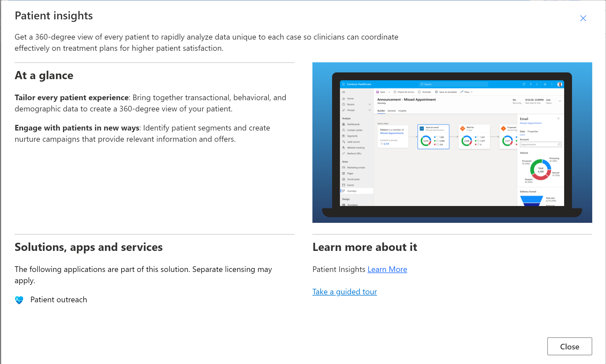
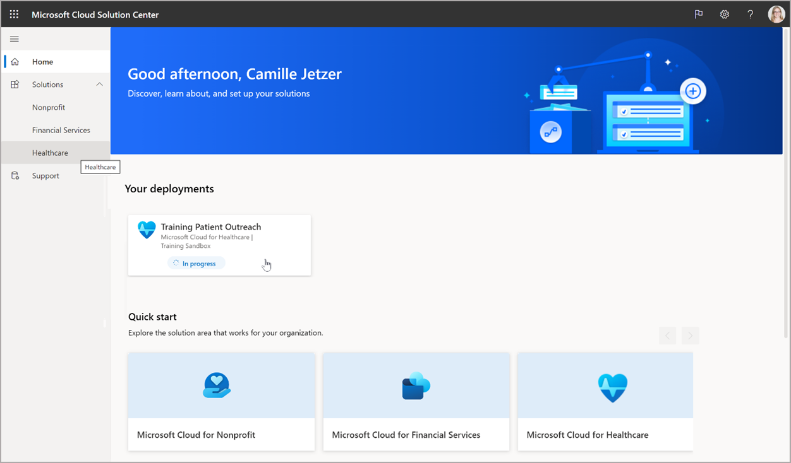

# Deploy Patient Outreach on Dynamics 365
>**Objective:** 
>Kick off installation of the Patient Outreach solution from Solution Center

## Pre-requisites
* D365 Environment with Marketing installed and configured
* D365 Service Admin user with Microsoft Cloud for Healthcare license

## Outcomes
* Installation of underlying solutions and data for Patient Outreach deployment will complete unattended (approximately 2 hours)
* Components installed:
    * Healthcare Foundations (CDM for Health, Forms, Views, etc.) 
    * Healthcare Controls
    * Patient Outreach App & Example config
    * Sync Admin for FHIR App & Maps
    * Healthcare Administration App
    * Virtual Clinic App

## Instructions
1.	Log into your Office 365 tenant with Cloud for Healthcare licensing, as a Dynamics 365 Service Administrator.
2.	Go to the Microsoft Cloud Solution Center: 
> https://solutions.microsoft.com

3. Click the **Microsoft Cloud for Healthcare** tile on the Home page, or browse into the Solutions group and select **Healthcare**.

4. Click the **Quick view** link on the **Patient Insights** tile which includes Patient Outreach, to see more information.

</img>

5.	**Close** the Patient insights quick view card, and click in the **Patient insights** tile to view the capability deployments.
6.	Click the **Quick view** link on the **Patient Outreach** deployment tile to see more information.
7.	Note the **Solution Dependencies** and **Post Deployment Configurations**, and click the **Learn more** link to review documentation. 

</img>

8.	**Close** the Patient outreach quick view card
9.	Check the **Add** box on the **Patient outreach** deployment tile and click **Deploy** on the top right, and follow the deployment wizard.
    * **Additional Components**: select to deploy both sample data and codeable concepts data  
    * **Set up new deployment**: 
        1. select the Dataverse environment to deploy to (where D365 Marketing is installed)
        2. name the deployment for future reference and update management, such as Training Patient Outreach
        3. acknowledge the Terms of Service
    * **Configure dependencies**: confirm that the Dynamics 365 Marketing dependency shows as installed and configured. If not, either complete the Marketing installation and re-check dependencies, or go back and select a different environment (step 9b).
    * **Deploy solution**: after clicking Deploy, the solutions will be installed unattended, and will take approximately two hours to complete. You can either stay on this page and watch progress, or close the page.

10.	Return to the **Home** page of the Solution Center, and you will see your named deployment listed with deployment status (In progress). 

> You completed the lab! 
Continue to the next module: [Agile Solution Design: A Patient Outreach User Story](https://github.com/microsoft/MC4H-Acceleration/tree/main/PatientOutreach_UserStoryTraining/1_Solution_Design)