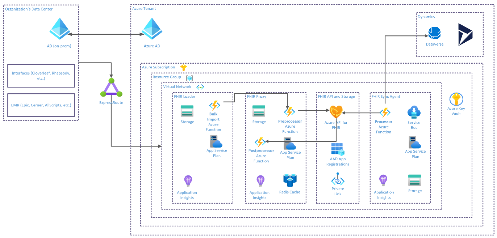

# Microsoft Cloud for Healthcare Landscape
> After reviewing this material, get hands on experience with: 
[Lab M1: Deploy Patient Outreach Capability](./Lab_M1)

## Patient Outreach: A Microsoft Cloud for Healthcare Capability

The **Patient Outreach** capability is delivered as an enabler for **Personalized Care** within the **Enhanced Patient Engagement** prioritized healthcare scenario.

## Patient Outreach Feature Summary

The Patient Outreach capability of the Microsoft Cloud for Healthcare is built on a set of FHIR Data Capabilities in Azure and Dynamics 365 base features, with added configurations, examples, and new Apps. 

### Key Data Platform Features
| **Azure Services** | **Open Source (OSS) on Azure** | **Connectors** |
| :---: | :---: | :---: |
| Azure API for FHIR | FHIR Server | Azure FHIR for Power Query |
| Healthcare APIs (preview) | FHIR Bulk Loader | FHIRBase for Power Platform (preview) |
| | FHIR Proxy | FHIRClinical for Power Platform (preview) |
| | FHIR Sync Agent | |

### Key Horizontal App Features Built Upon
| **Dynamics 365 Marketing** | **Dynamics 365 Customer Insights** |
| :---: | :---: | 
| Segmentation | Measures / KPIs |
| Multi-channel campaigns (Customer Journeys) | Advanced Segmentation |
| Campaign Automation & Tracking | Customer Card for D365 |
|Event Management | |
| Lead Scoring & Management | |
| Social Engagement| |

### Key Power Platform & Dynamics 365 Extensions
| **Base Dataverse Extensions** | **Patient Outreach App** | **Dataverse FHIR Interoperability** |
| :---: | :---: | :---: |
| Healthcare Data Model (CDM) | Healthcare-branded Outbound Marketing model app | Sync Admin for FHIR App | 
| Healthcare Forms & Views | Sample Patient Segment Definitions | FHIR Sync Agent Integration Mgt | 
| Patient Timeline Control | Sample Patient Event Definitions | FHIR to CDM for Health Mapping | 
| Care Team Visualization Control  | | FHIR Synced Clinical Data Mgt Center |
| | | Virtual Health Data Tables (preview) |

## Reference Architectures

Below is a high level reference architecture that shows one potential way these pieces can work together for a full stack Microsoft Cloud for Heatlhcare solution to Patient Outreach. This is a good reference but should be tailored to each customer’s specific use case. For instance, data ingestion from Azure FHIR Services to D365 Customer Insights may use $export to ADLS instead depending on data volume and complexity. 

As we know we will need patient data to effectively target patient cohorts, we are also interested in a more detailed look at the Azure FHIR Services and Sync Agent blocks in the Patient Outreach reference architecture. 

