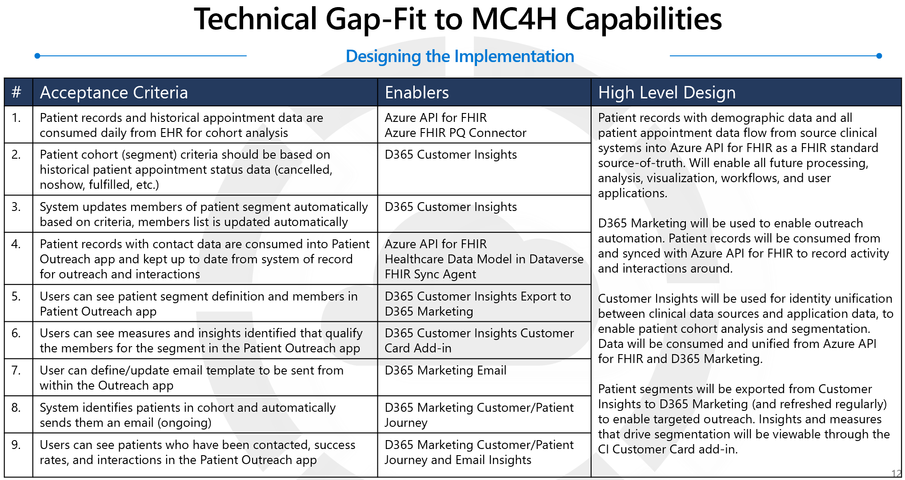
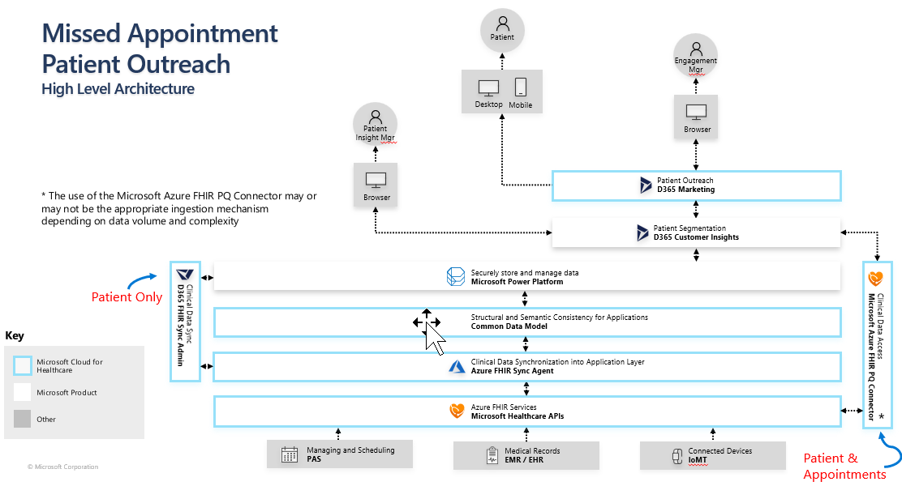
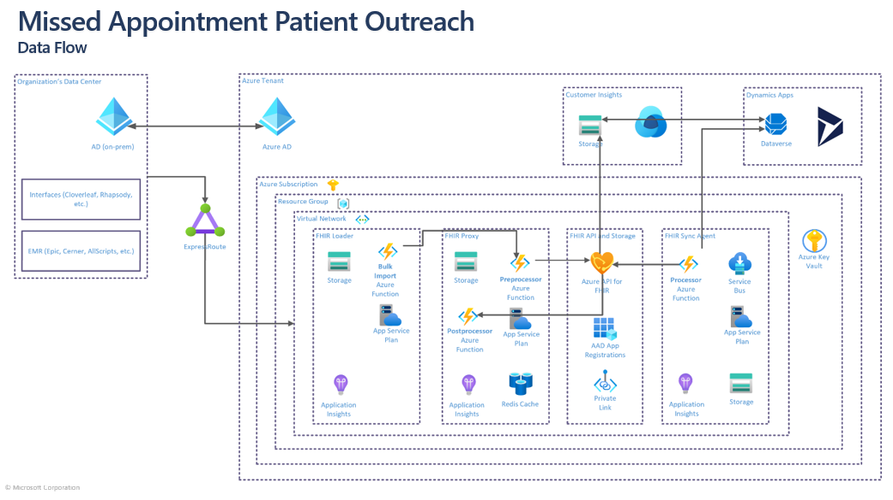

# Agile Single Story Solution Design
> An exercise in agile implementation with the Microsoft Cloud for Healthcare. Defining and designing the solution for a single Patient Outreach User Story. 

## Defining the User Story

> User Story: 
**A description of a feature or function from a user’s perspective** 
**Who** (User Role), **What** (Functional Acceptance Criteria), **Why** (Goal or Desired Outcome)

To reduce initial time to value, we recommend focusing on a single User Story that will deliver value to end users quickly. The scope of the user story should include end-to-end design and implementation of data flow through integrated systems and capabilities necessary.

>  
<b>User Story: Missed Appointment Patient Outreach</b>

> 
<em>As a Patient Engagement manager…</em>

> 
I want an automated process to identify patients who often miss appointments, and inform them of Virtual Visit options

> 
<em>…so that I can improve access to care for those patients</em>
 

An ideal agile approach focuses on delivery of integrations and capabilities only as required to deliver the first prioritized single user story, allowing for effective unit testing and quicker delivery of value to the users. 

## The MVP Solution Design

### Step 1: Gap-Fit

To begin gap fit against tool sets and capabitlies, requirements (or acceptance criteria) need to be clearly laid out. Pre-defined Architecture Principals are also considered in the design

> [Architecture Principles Starter Kit](./ArchitecturePrincipleStarterKit.docx) 

The below is an example of this exercise against the Microsoft Cloud for Healthcare capabilities for Patient Outreach, with the Patient Outreach reference architecture as a guide. 

> Review the previous module: [Microsoft Cloud for Heatlhcare Landscape for Patient Outreach](https://github.com/microsoft/MC4H-Acceleration/tree/main/PatientOutreach_UserStoryTraining/0_MC4H_Landscape)

> IMPORTANT NOTE: 
The use of the Microsoft Azure FHIR PQ Connector may or may not be the appropriate ingestion mechanism into Customer Insights depending on data volume and complexity. **TO DO: FIND REFERENCE MATERIAL TO LINK TO FOR INGESTION APPROACH CONSIDERATIONS**

### Step 2: Minimum Data Requirements

Digging deeper into each Acceptance Criteria with data elements, we can define our minimum Data Requirements, mapped to the FHIR specification, to inform our integration architecture and data flow design. 

> Data model references used to map acceptance criteria into data element requirements: 
> * [FHIR v4.0.1 specification of Resources](https://www.hl7.org/fhir/resourcelist.html) 
> * [Microsoft Common Data Model for Healthcare](https://docs.microsoft.com/en-us/common-data-model/schema/core/industrycommon/healthcare/healthcare-overview)

| # | Acceptance Criteria | Minimum Data Elements | Source | Target |
| --- | --- | --- | --- | --- |
| 1. | Patient records and historical appointment data are consumed daily for cohort analysis | <ul><li>Patient [id, meta.lastUpdated, name, birthDate, telecom (system=email)]</li><li>Appointment [id, status, serviceType, appointmentType, start, participant (type=patient)]</li> | Azure FHIR Services | D365 Customer Insights |
| 2. | User defines/adjusts patient cohort (segment) criteria based on historical patient appointment status data | See 1 | See 1 | See 1 |
| 4. | Patient records with contact data are consumed and kept up to date from system of record for outreach/communications | Patient [identifier, name, birthDate, telecom (system=email)] | Azure FHIR Services | D365 Marketing (Dataverse) |
| 5. | User can see patient segment definition and members in Patient Outreach app | Segments with members | D365 Customer Insights | D365 Marketing (Dataverse) |
| 6. | User can see measures and insights identified that qualify the members for the segment | Patient [contactid, firstname, lastname, birthdate, EMailAddress1, msemr_azurefhirid] | D365 Marketing (Dataverse) | D365 Customer Insights |

### Step 3: Architecture & Data Flow

> Review the previous module to find reference architectures:  [Microsoft Cloud for Heatlhcare Landscape for Patient Outreach](https://github.com/microsoft/MC4H-Acceleration/tree/main/PatientOutreach_UserStoryTraining/0_MC4H_Landscape)

Starting from the Microsoft Cloud for Healthcare reference architectures for Patient Outreach we make adjustments to represent our User Story actors, and make some contextual notes.

Starting from the Microsoft Reference Architecture for Healthcare Data, we add our Target systems of Customer Insights and D365/Dataverse and illustrate data flow.

