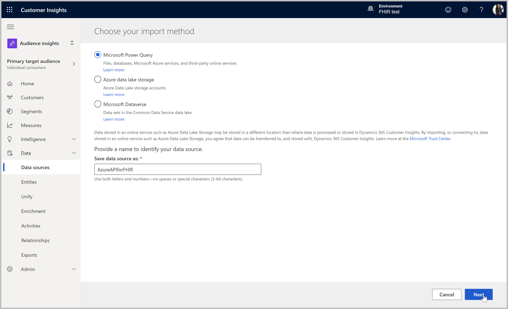
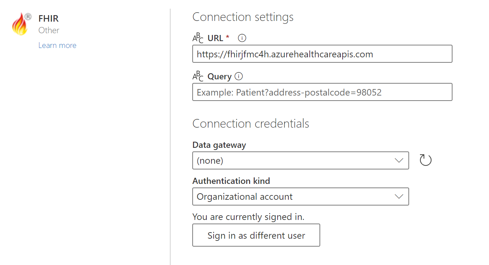
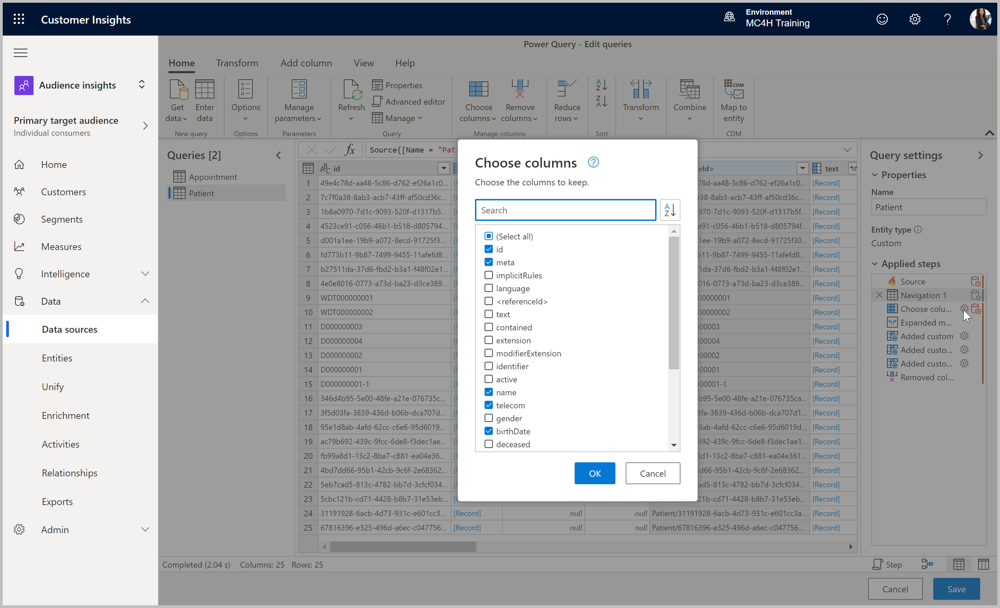
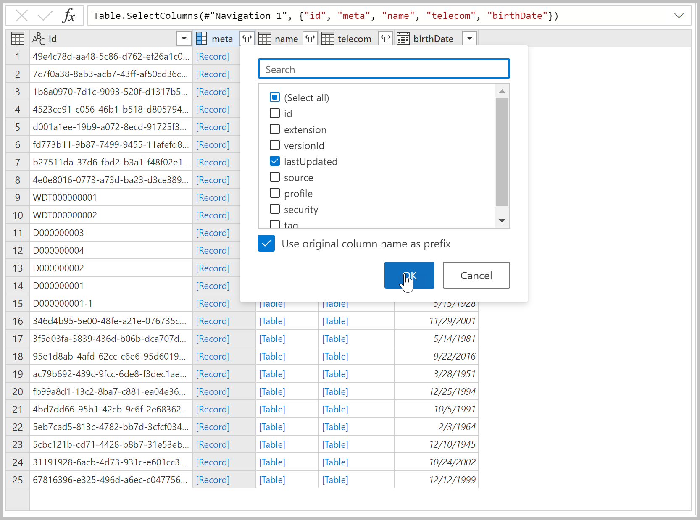
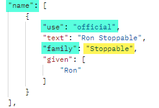
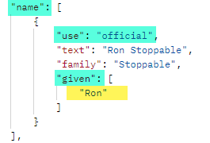
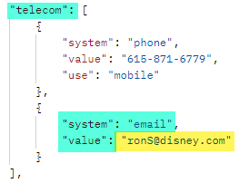
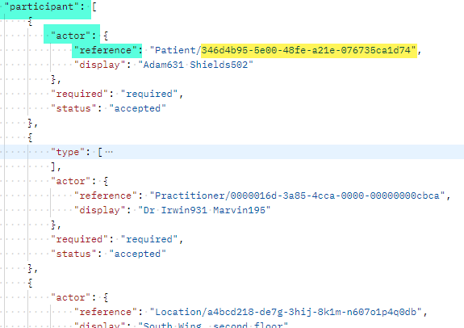

# Ingest FHIR Data into Customer Insights
>**Objective:**<br>
>Configure Azure FHIR Power Query connector to ingest Patient and Appointment data into Customer Insights

## Outcomes
* Successful authentication and connection to Azure API for FHIR via the FHIR Connector
* Patient and Appointment resources ingested into Customer Insights, ready for processing
> **Estimated Time Commitment:**<br>
> About 30min active time, about 20 minutes unattended processing time

## Pre-requisites
* Customer Insights tenant subscription
* Customer Insights environment created [Start with Customer Insights](https://docs.microsoft.com/en-us/dynamics365/customer-insights/paid-license)
* Admin or Contributor permissions to the Customer Insights environment
* URL of the deployed Azure API for FHIR, accessible from the Customer Insights tenant
    * Should be of the format `https://[AzureAPIforFHIRName].azurehealthcareapis.com`
* User with FHIR Data Exporter access role assigned in Azure API for FHIR for Organizational authentication:  [FHIR Power Query authentication - Power Query | Microsoft Docs](https://docs.microsoft.com/en-us/power-query/connectors/fhir/fhir-authentication#azure-active-directory-organizational-authentication)

## Step 1: Connect with the FHIR Power Query Connector

> NOTE: Use of the FHIR connector was selected as one ingestion method for FHIR data into Customer Insights. This may or may not be the appropriate ingestion pattern depending on data volume and complexity of the customer scenario.

1.	Go to the Customer Insights application and select the correct environment in the upper right corner if necessary.<br>
> https://home.ci.ai.dynamics.com/


2.	Ensure Audience Insights area selected, top left (default).

3. Expand into **Data sources**, click **Add data source** and complete the wizard to ingest Patients and Appointments:

    * Leave **Microsoft Power Query** selected, name the data source **AzureAPIforFHIR** and click **Next**.
    * Select **FHIR** connector (hint: use the search bar), click **Next**.
    * Enter the Azure API for FHIR **URL** in below format, leaving **Query** blank<br>
    `https://[AzureAPIforFHIRName].azurehealthcareapis.com`
    * Authenticate with **Organizational account**, see pre-requisites for account requirements. Click **Next** once authenticated.
    * In list of available tables (may take time to load), check **Appointment** and **Patient**, and click **Transform data**.




</img>

## Step 2: Transform the Patient Data with Power Query

1.	Select the **Patient** table in the **Queries** pane.
2.	Use **Choose Columns** to remove all columns except **id, meta, name, telecom, birthDate**.



3.	Note that the **meta**, **name** and **telecom** columns contain nested records and tables due to the FHIR data structure. 
4.	Use expand for the **meta** column, as it contains a single record in each row:
    * Click the **Expand** button on the **meta** column header.
    * Select only the **lastUpdated** column of the nested record.
    * Click **OK** to replace the meta column with **meta.lastUpdated**.


</img>

5.	Use custom columns to retrieve first (given) and last (family) names from **name**, which contains a nested table. We only want data from the first record where **use** is **official**:
    * In the **Add column** ribbon tab, click **Custom Column**.
    * Define **lastname** with formula below. 
    * Repeat steps above to add **firstname** with formula below.
    > Refer to the sample FHIR JSON object below to better understand how the formula returns the value in yellow.

    | **Column name** | **Custom column formula** | **Sample FHIR JSON name object** |
    | --- | --- | ---| 
    | lastname | `List.First ( Table.FirstN ( [name] , each [use] = "official" ) [family] )` |  |
    | firstname | `List.First ( List.First (Table.FirstN ( [name] , each [use] = "official" ) [given] ) )` | |

6.	The **telecom** data element can contain multiple entries for contact information including phone and email. Use a custom column to return only the first email address of the patient:
    * In the **Add column** ribbon tab, click **Custom Column**.
    * Define **email** with formula below. 
    > Refer to the sample FHIR JSON object below to better understand how the formula returns the value in yellow.

    | **Column name** | **Custom column formula** | **Sample FHIR JSON name object** |
    | --- | --- | ---| 
    | email | `List.First (Table.FirstN ( [telecom] , each [system] = "email" ) [value] )` |  |

7.	Finally, select the **name** and **telecom** table columns and click **Remove Columns**
8.	The result is a flattened table including only: **id, brithDate, firstname, lastname and email**.

> NOTE: Do not save changes yet, as you will continue with appointment transfromations in the next step. If you saved accidentally, cancel the refresh and edit the data source again to continue.

### Advanced Editor Query

For those who are advanced users of Power Query and are comfortable working with the Advanced Editor to build the query rather than using the UI to build the transformation steps, the resulting query of the steps in this section are below.

```
let
    Source = Fhir.Contents("[your_AzureAPIforFHIR_URL]", null),
    #"Navigation 1" = Source{[Name = "Patient"]}[Data],
    #"Choose columns" = Table.SelectColumns(#"Navigation 1", {"id", "meta", "name", "telecom", "birthDate"}),
    #"Expanded meta" = Table.ExpandRecordColumn(#"Expanded address", "meta", {"lastUpdated"}, {"meta.lastUpdated"}),
    #"Added custom" = Table.AddColumn(#"Expanded meta", "lastname", each List.First(Table.FirstN([name], each [use] = "official")[family])),
    #"Added custom 1" = Table.AddColumn(#"Added custom", "firstname", each List.First(List.First(Table.FirstN([name], each [use] = "official")[given]))),
    #"Added custom 2" = Table.AddColumn(#"Added custom 1", "email", each List.First(Table.FirstN([telecom], each [system] = "email")[value])),
    #"Removed columns" = Table.RemoveColumns(#"Added custom 2", {"name", "telecom"})
in
  #"Removed columns"
```


## Step 3: Transform the Appointment Data with Power Query

1.	Select the **Appointment** table in the **Queries** pane.
2.	Use **Choose Columns** to remove all columns except **id, status, serviceType, appointmentType, start, participant**.
3.	Note that the **serviceType**, **appointmentType**, and **participant** columns contain nested records and tables due to the FHIR data structure. 
4.	Use expand for the **serviceType** column, as no filtering of nested data is required. Two expansion steps will be required:
    * Click the **Expand** button on the **serviceType** column header.
    * Select only **coding** and click **OK** to replace the serviceType column with a new **serviceType.coding** column containing a table.
    * Click the **Expand** button on the **serviceType.coding** column header.
    * Select both **code** and **display** to replace the serviceType.coding column with two new **serviceType.coding.code** and **serviceType.coding.display** columns.
5.	Repeat **Step 4** above to expand **appointmentType** out to **appointmentType.coding.code** and **appointmentType.coding.display** columns. While the appointmentType contains a record rather than a table, the formation is similar. 
6.	Use custom columns to parse the **participant** column, containing a nested table of different types of participants. We only want data from the first record where the **actor** is **Patient**.
    * Add a **Custom Column** named **patientName** with below formula, to select the first **actor** record where **reference** begins with **Patient**, returning the **display** value:

    | **Sample FHIR JSON name object** | **Custom column formula** | 
    | --- | --- |
    |  | `List.First ( [participant] [actor] , each Text.StartsWith ( [reference] , "patient" ) ) [display]` |

    * Add a **Custom Column** named **patientId** with below formula, to select the first **actor** record where **reference** begins with **Patient**, parsing the id out of the **reference** value. 

    | **Sample FHIR JSON name object** | **Custom column formula** | 
    | --- | --- |
    |  | `Text.Replace ( List.First ( [participant] [actor] , each Text.StartsWith ( [reference] , "patient" ) ) [reference] , "Patient/" , "" )` |

    * Finally, select the original **participant** column and click **Remove Columns**.
7.	The result is a flattened Appointment table with **id, status, serviceType.coding.code, serviceType.coding.display, appointmentType.coding.code, appointmentType.coding.display, start, patientName** and **patientId**.
8.	Click **Next**, leave as **Manual Update**,  and **Save**. 
9. Let validation complete, and the new datasource will be listed with status **Refreshing**.

### Advanced Editor Query

For those who are advanced users of Power Query and are comfortable working with the Advanced Editor to build the query rather than using the UI to build the transformation steps, the resulting query of the steps in this section are below.

```
let
    Source = Fhir.Contents("[your_AzureAPIforFHIR_URL]", null),
    #"Navigation 1" = Source{[Name = "Appointment"]}[Data],
    #"Choose columns" = Table.SelectColumns(#"Navigation 1", {"id", "status", "serviceType", "appointmentType", "start", "participant"}),
    #"Expanded serviceType" = Table.ExpandTableColumn(#"Choose columns", "serviceType", {"coding"}, {"serviceType.coding"}),
    #"Expanded serviceType.coding" = Table.ExpandTableColumn(#"Expanded serviceType", "serviceType.coding", {"code", "display"}, {"serviceType.coding.code", "serviceType.coding.display"}),
    #"Expanded appointmentType" = Table.ExpandRecordColumn(#"Expanded serviceType.coding", "appointmentType", {"coding"}, {"appointmentType.coding"}),
    #"Expanded appointmentType.coding" = Table.ExpandTableColumn(#"Expanded appointmentType", "appointmentType.coding", {"code", "display"}, {"appointmentType.coding.code", "appointmentType.coding.display"}),
    #"Added custom" = Table.AddColumn(#"Expanded appointmentType.coding", "patient.name", each List.First([participant][actor], each Text.StartsWith([reference],"patient"))[display]),
    #"Added custom 1" = Table.AddColumn(#"Added custom", "patient.id", each Text.Replace(List.First([participant][actor], each Text.StartsWith([reference],"patient"))[reference],"Patient/", "")),
    #"Removed columns" = Table.RemoveColumns(#"Added custom 1", {"participant"})
in
  #"Removed columns"
```

## Step 4: View Ingested Tables

1.	Once the initial refresh job completes (about 20 minutes), the data source will show **Successful** in the **Data Sources** area. 
2. Navigate into **Entities** to find two new tables: **Appointment** and **Patient**. 
3.	Click into each table to review the Attributes being ingested, and to validate that the data is coming in as expected. 

> You completed the lab!<br>
Continue to the next lab: [Ingest D365 Data into Customer Insights](https://github.com/microsoft/MC4H-Acceleration/tree/main/PatientOutreach_UserStoryTraining/4_Customer_Insights_Config/Lab_CI2)