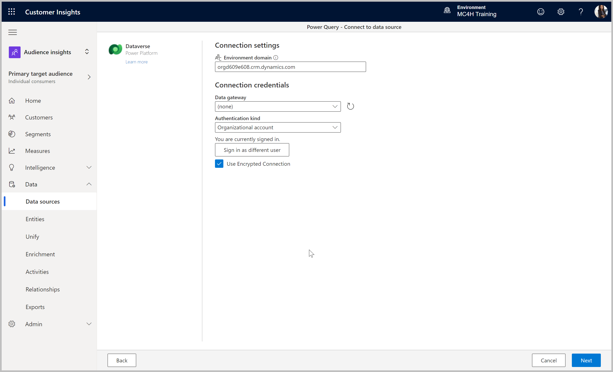
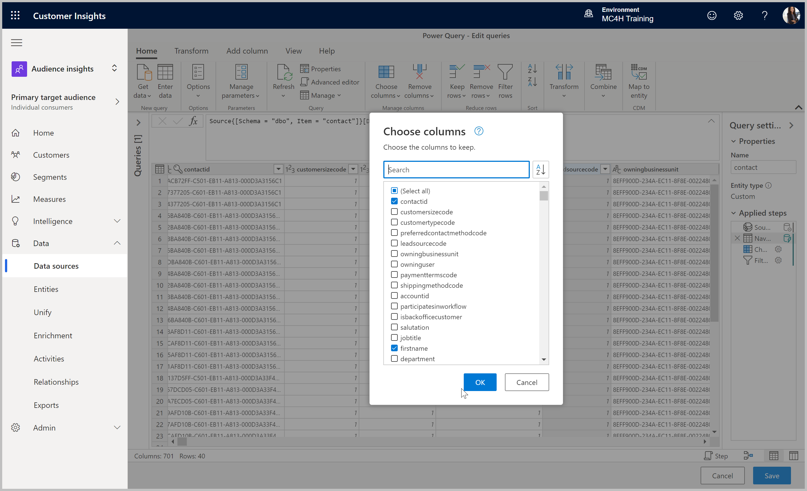
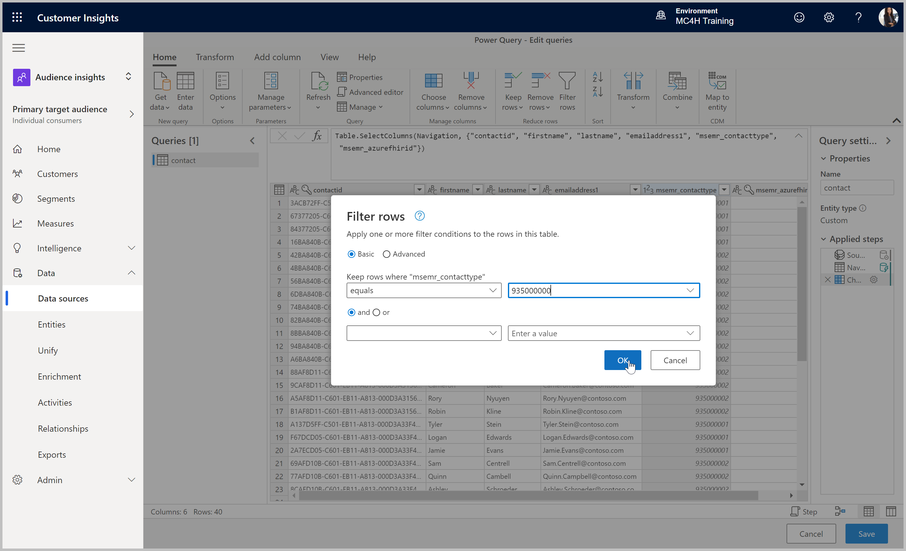
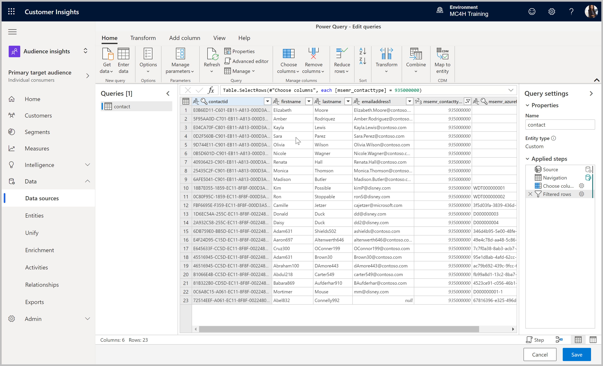
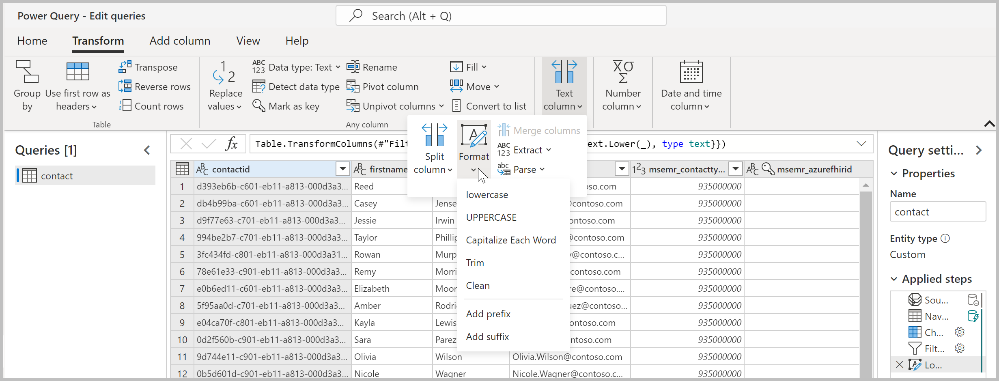
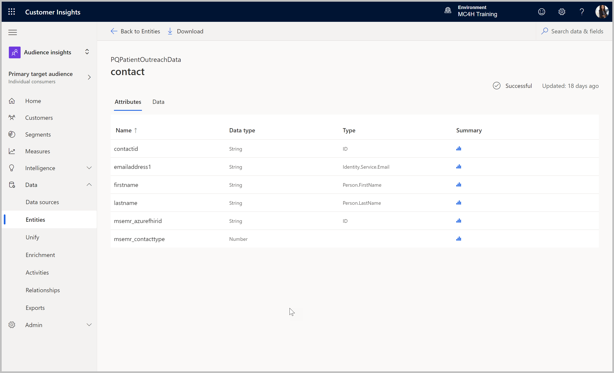

# Ingest D365 Data into Customer Insights
>**Objective:** 
> Configure the Dataverse connector to ingest Patient record with Dataverse identifier to unify with patient data from FHIR Server (for contextual insight visibility in Patient Outreach App)  

## Pre-requisites
* Customer Insights tenant subscription
* Customer Insights environment created [Start with Customer Insights](https://docs.microsoft.com/en-us/dynamics365/customer-insights/paid-license)
* Admin or Contributor permissions to the Customer Insights environment
* Access and permissions to the D365 environment

## Outcome
* Successful ingestion of Contact (Patient) data into Customer Insights from a Dynamics 365 Marketing environment

## Step 1: Connect with the Dataverse Power Query Connector

1.	If not already there, go to the Customer Insights application and select the correct environment in the upper right corner if necessary. 
> https://home.ci.ai.dynamics.com/

2.	Within the Audience Insights capability (default), expand into **Data sources**, click **Add data source** and follow through the Wizard to retrieve the Contact table from the Dynamics 365 Marketing Dataverse:
    * Leaving **Microsoft Power Query** selected, name the data source D365Patients or something similar and click **Next**.
    * Find and select the **Dataverse** connector in the list and click **Next**.
        > HINT: use the search bar to find "Dataverse"
    * Enter the **Environment domain** to the Dynamics 365 Marketing org in the below format 
    `[orgname].crm.dynamics.com` 
        > NOTE: if in a region other than North America the .crm domain may be different
    * Authenticate with **Organizational account**, using an account with at least read access on the Patient Contacts of interest. Click **Next** once authenticated.
    * Once the list of available tables in the Dataverse load, check the **Contact** table, and click **Transform data**.

## Step 2: Filter the Contact Data with Power Query

1. Use **Choose Columns** to remove all columns except **contactid, firstname, lastname, emailaddress1, msemr_contacttype,** and **msemr_azurefhirid**. 
    > HINT: use the search bar to find and check each column

2.	To limit the contacts we ingest to Patients only (ignoring Providers or other types of contacts), we will filter on **Contact Type**: 
    * Select the **msemr_contacttype** column
    * Click **Filter rows** in the ribbon (or **Reduce rows > Filter rows**)
    * Set the filter to **equals 935000000** and click **OK**
    > NOTE: we confirmed this value of the option set value with display “Patient” as a part of the delivered Cloud for Healthcare solutions. Option set values can be validated in the maker portal by viewing the attribute configuration.

3.	The result should be a list of only patients with desired columns. 

> NOTE: If you also want to ingest other contact types from Dynamics 365 to Unify with Patient records, create separate data sources for each type. The table name can be changed in the Query pane from Contacts to Patients to prevent duplicates before saving (example: Patients may also be Providers or Employees, with separate contact records in Dynamics 365 to represent each type for a single person). 

4. Due to a known issue in the Power Query connector, the unique identifier may be returned in all capital letters, which will cause issues with the Contact Card integration in the Dynamics forms. If you have this issue, select the contactid column, and select Format > lowercase in the Text column group of commands in the Transform ribbon.

5.	Click **Save** to complete the data source definition and initiate the first retrieve. The data source will be listed with status **Refreshing**.

## Step 3: Validate Ingested Tables

1.	Once the initial data source refresh job completes, it will show with a **Successful** Status in the **Data Sources** area. Navigate into the **Entities** area to find a new **contact** table listed under the **User** group. 
2.	Clicking into each table allows you to review the **Attributes** being ingested, as well as the actual data. Validate that the data is coming in as expected. 

> You completed the lab! 
Continue to the next lab: [Map, Match & Merge Patient Data](https://github.com/microsoft/MC4H-Acceleration/tree/main/PatientOutreach_UserStoryTraining/4_Customer_Insights_Config/Lab_CI3)
