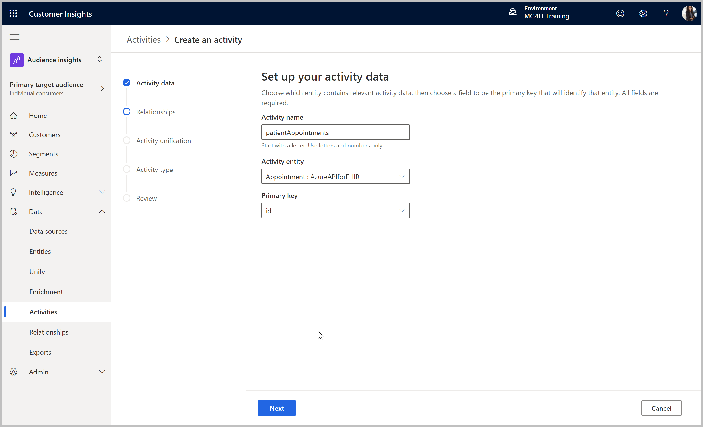
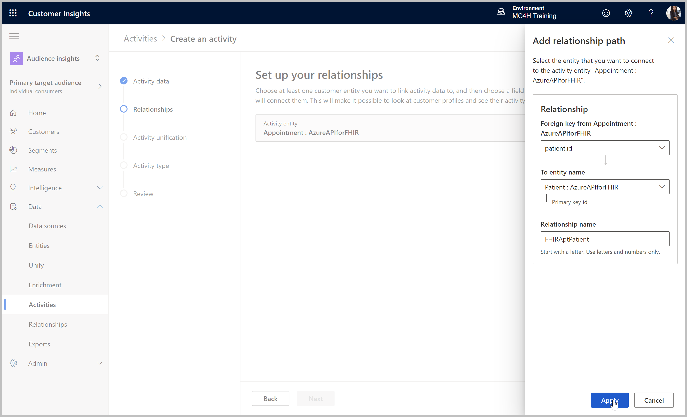
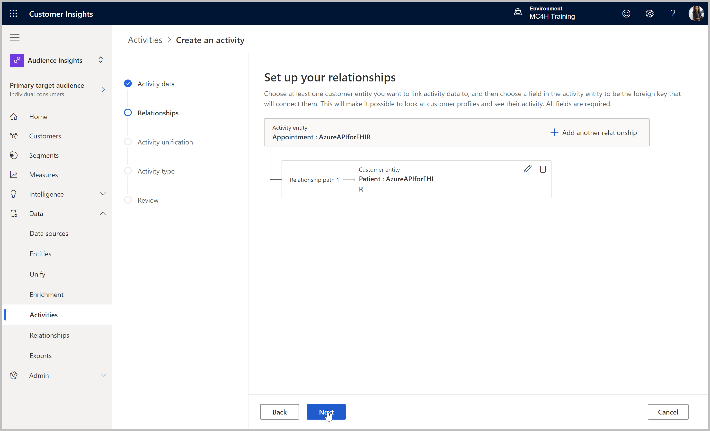
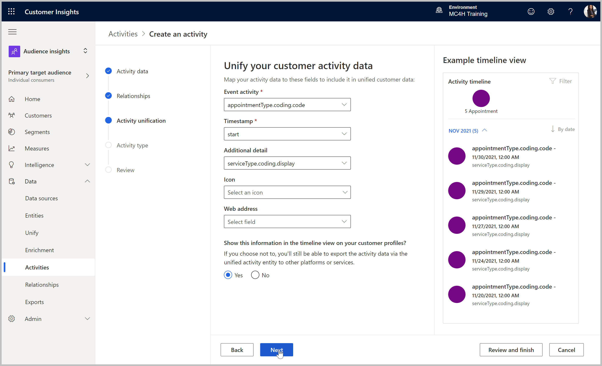
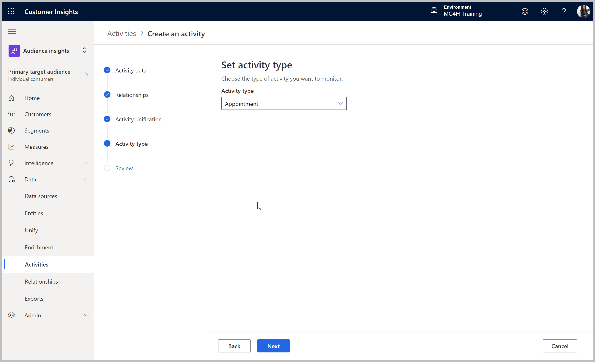
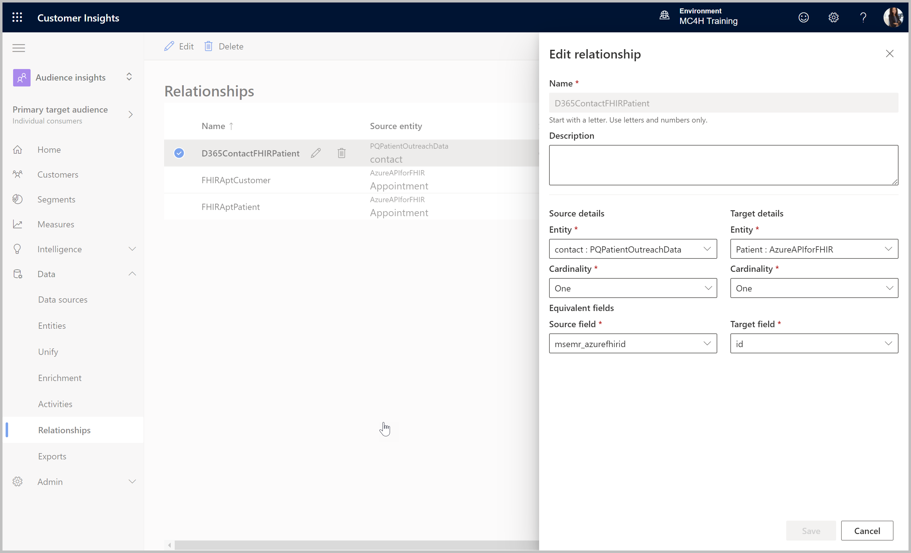
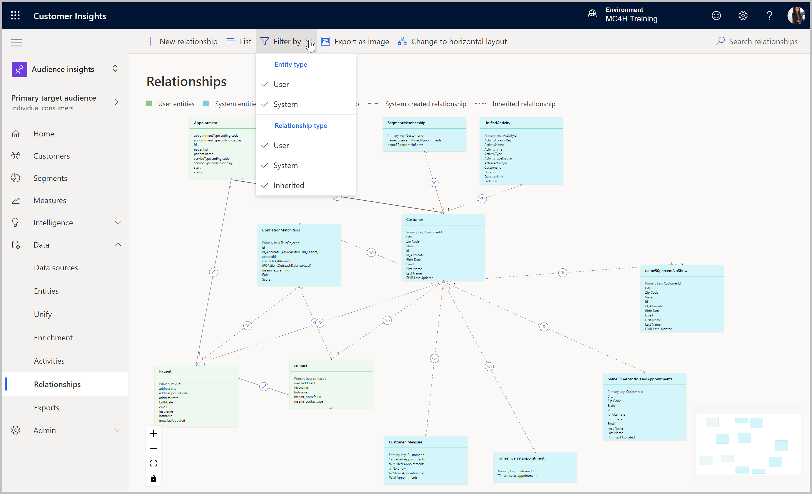
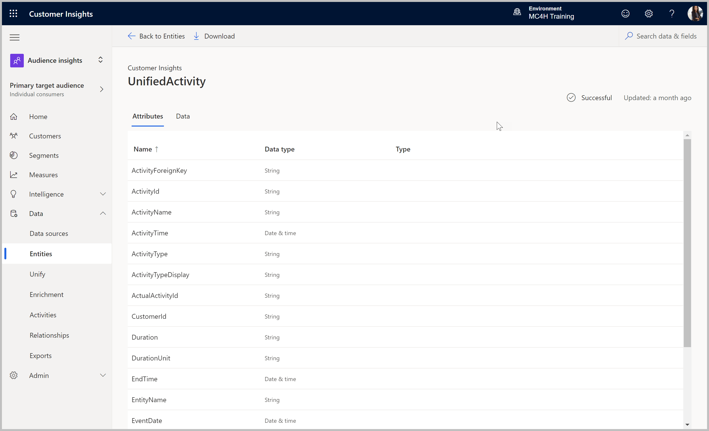

# Define Relationships & Activities
>**Objective:** 
Define relationships between unified data sets, and map Appointment data to the Activity CDM to populate the Unified Profile timeline.

## Outcomes
* Appointment entity defined as an Activity, and visible in the timeline of Unified Profiles
* Relationships defined between Appointment, D365 Contact, and API for FHIR Patient data sets for use in defining measures and segments
> **Estimated Time Commitment:** 
> About 15min active time

## Pre-requisites
* Customer Insights tenant subscription
* Admin or Contributor permissions to the Customer Insights environment
* Customer Insights labs [CI1](https://github.com/microsoft/MC4H-Acceleration/tree/main/PatientOutreach_UserStoryTraining/4_Customer_Insights_Config/Lab_CI1),  [CI2](https://github.com/microsoft/MC4H-Acceleration/tree/main/PatientOutreach_UserStoryTraining/4_Customer_Insights_Config/Lab_CI2), and [CI3](https://github.com/microsoft/MC4H-Acceleration/tree/main/PatientOutreach_UserStoryTraining/4_Customer_Insights_Config/Lab_CI3) completed

## Step 1: Set Up Appointment Activity
All data sources considered Activities should be defined as such, and mapped to the common data model to add those records to the Unified Activity entity, which will populate the timeline feed for the Unified Profile. This configuration will determine what details of the appointment record will show in the unified appointment activity in the timeline. 

1.	If not already there, go to the Customer Insights application and select the correct environment in the upper right corner if necessary. 
> https://home.ci.ai.dynamics.com/

2. Ensure Audience Insights area is selected, top left (default).

3. Expand into **Data > Activities** in navigation, and select **Create an activity**.

4. Set up Activity data:
    * Activity name: patientAppointments
    * Activity entity: **Appointment : AzureAPIforFHIR** 
    * Primary key: **id**
    * click **Next**

5. Configure Relationships:
    * **Add a relationship** 
    * Foreign key from Appointment: **patient.id**
    * To entity name: **Patient : AzureAPIforFHIR**
    * Relationship name: FHIRAptPatient
    * Click **Apply**

6. Review the defined relationship path and click **Next** to continue defining the activity. 

7. Activity unification - select timeline attributes:
    * Event activity: **appointmentType.coding.code**
    * Timestamp: **start**
    * Additional detail: **serviceType.coding.display**
    * Icon: blank
    * Web address: blank
    * Show this information in the timeline: **Yes**

7. Once happy with the timeline view of the activity, click **Next**, and select **Appointment** as the Activity Type. 

8. Click **Next** to the **Review** page and **Save activity**. The new activity will be listed. If the status at the top right does not already say **Refreshing**, click **Run**. 

## Step 2: Define Relationships

1. Go to **Relationships** under the Data navigation branch. The relationship just defined as a part of the Appointment Activity should be listed. 

2. To add more relationship paths for use in building measures, segments, etc., select **New Relationship**. The below lists some relationships that can be created.
> Which relationships to define? 
> Relationship paths are important to be able to effectively use related data together in measure or segment logic. For instance, to build measures on appointment information beyond the few attributes included in the Unified Activity, you will need a relationship path to the underlying Appointment entity from the Unified Customer.

| Relationship | Entity | Cardinality | Field (Key) |
| --- | --- | --- | --- |
| DataversePatientToFHIRPatient | contact : [Dataverse patient data source] | One | msemr_azurefhirid |
|  | Patient : [FHIR API data source] | One | id |
| FHIRAptToUnifiedCustomer | Appointment : [FHIR API data source] | Many | patient.id |
|  | Customer : CustomerInsights | One | id |

> NOTE: 
> Because the unified Customer entity inherits the keys from each source entity, the **id** field in the Customer table is the inherited unique FHIR ID, and the **contactid** in the Customer table is the inherited unique Dataverse ID. If this is confusing, key fields can be renamed during the transformation process of the Data Sources to be more descriptive. Non-key fields can be renamed during the Merge stage of the Unification process. 

4. After creating relationships, click the Visualizer button to change the view, and adjust the filter to show all entity and relationship types as another way to verify your relationship paths. 

## Validate Unified Activity Data

1. When the Activity refresh is complete (a few minutes) the **Activity** page will show a status of **Successful**.
2. Navigate into **Entities** to find the **UnifiedActivity** entity listed under the **Activities** group. 
3.	Click into the entity to review the unified activity attributes and data. 

> You completed the lab! 
Continue to the next lab: [Create Patient Measures and Segments](https://github.com/microsoft/MC4H-Acceleration/tree/main/PatientOutreach_UserStoryTraining/4_Customer_Insights_Config/Lab_CI5)