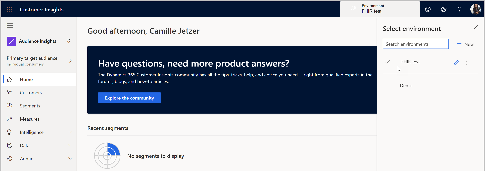
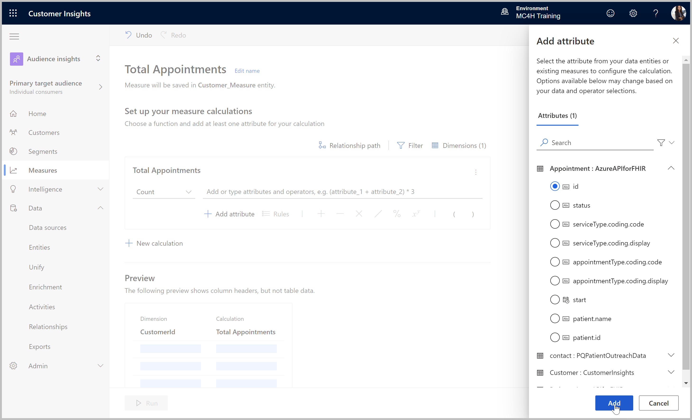
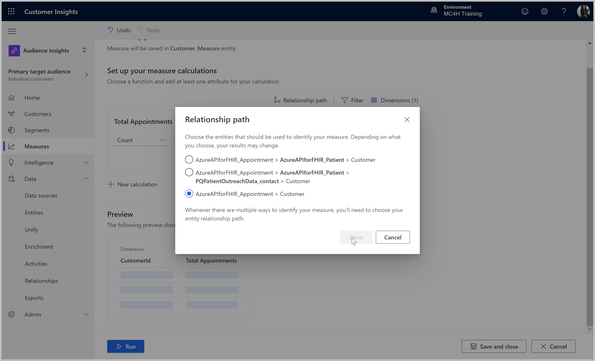
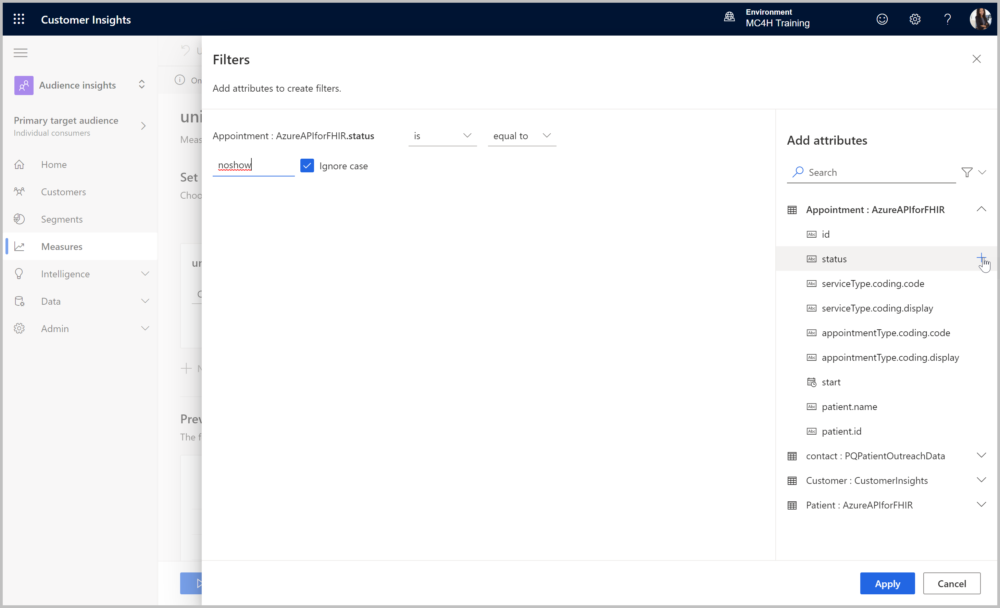
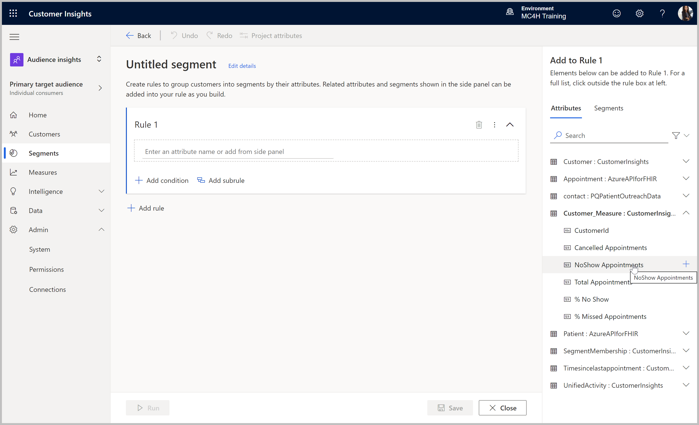
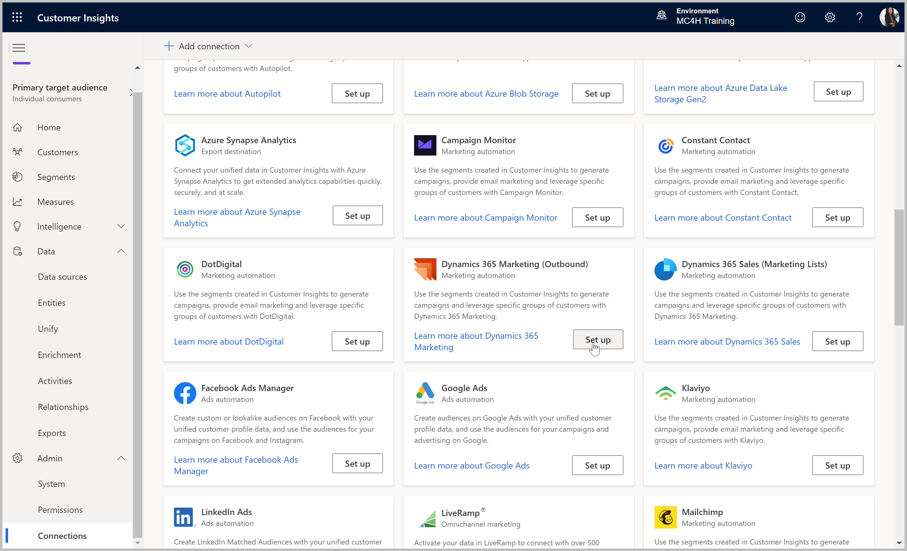
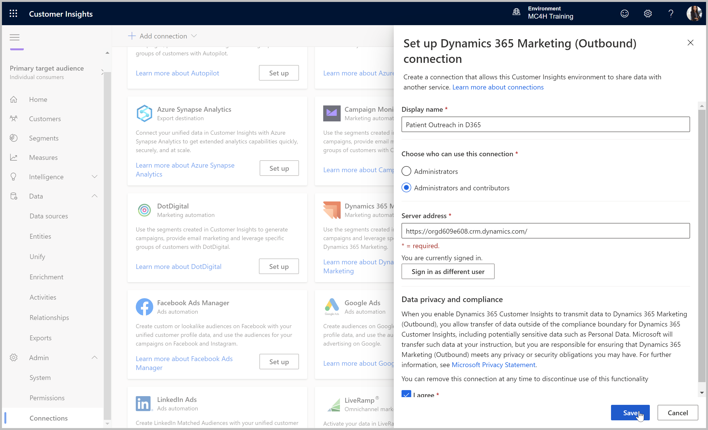
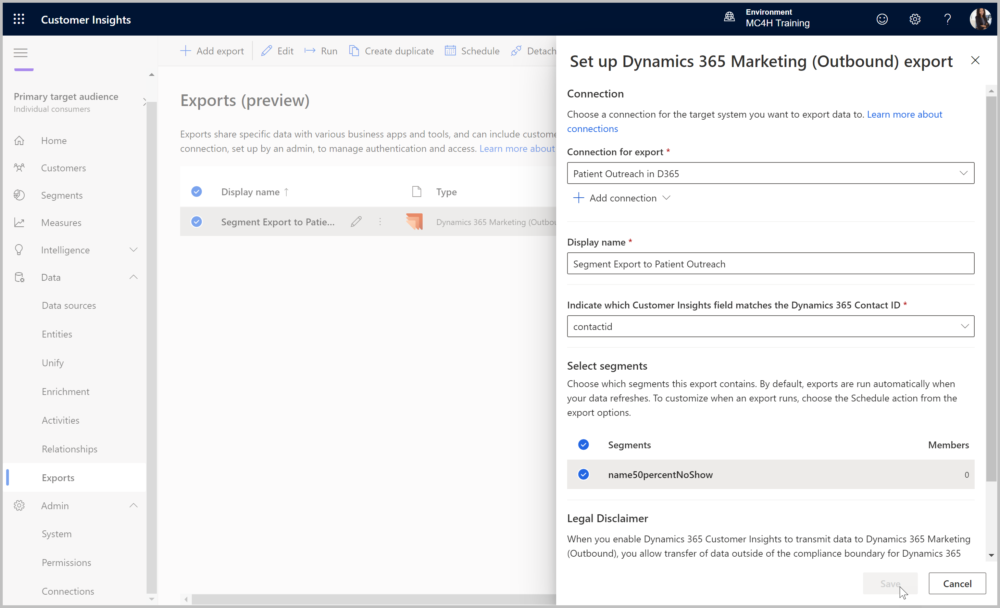

# Define Patient Measures & Segments
>**Objective:** 
Configure key measures based on historical appointment data, and segments based on those measures for use within Dynamics 365 Marketing.

## Pre-requisites
* Customer Insights tenant subscription
* Admin or Contributor permissions to the Customer Insights environment
* Access and permissions to the D365 environment
* Customer Insights labs [CI1](https://github.com/microsoft/MC4H-Acceleration/tree/main/PatientOutreach_UserStoryTraining/4_Customer_Insights_Config/Lab_CI1),  [CI2](https://github.com/microsoft/MC4H-Acceleration/tree/main/PatientOutreach_UserStoryTraining/4_Customer_Insights_Config/Lab_CI2), [CI3](https://github.com/microsoft/MC4H-Acceleration/tree/main/PatientOutreach_UserStoryTraining/4_Customer_Insights_Config/Lab_CI3), and [CI4](https://github.com/microsoft/MC4H-Acceleration/tree/main/PatientOutreach_UserStoryTraining/4_Customer_Insights_Config/Lab_CI4) completed

## Outcomes
* Published Missed Appointment Measures
* Missed Appointment patient segments configured and exported to Dynamics 365 Marketing

## Step 1: Conigure Measures

1.	If not already there, go to the Customer Insights application and select the correct environment in the upper right corner if necessary. 
> https://home.ci.ai.dynamics.com/

2. Within the Audience Insights capability (default), select **Measures** and click **New measure**.

3. Click **Edit name** and name the measure **Total Appointments**.

4. Set the formula to `Count Unique [FHIR data source]_Appointment.id`:
    * Click **Select function** and choose **Count** 
    * Click **Add attribute** and select **Appointment: id**

5. Click **Relationship path** to define the path to Appointment from the unified Customer, and select the most direct path.

6. Click **Run** to save the measure and run the calculation.

7. Repeat the previous steps to create more measures, as listed in the table below. Use the **Filter** option of the measure to add filters on the Appointment.status field.

| Measure | Formula | Filter |
| --- | --- | --- |
| NoShow Appointments | `Count Unique [FHIR data source]_Appointment.id` | `Appointment.status is equal to noshow` (ignore case) |
| Cancelled Appointments | `Count Unique [FHIR data source]_Appointment.id` | `Appointment.status is equal to cancelled` (ignore case) |
| % No Show Appointments | `Average ( Customer_Measure.NoShowAppointments / Customer_Measure.TotalAppointments ) * 100` | none |
| % Missed Appointments | `Max  ( ( Customer_Measure.NoShowAppointments + Customer_Measure.CancelledAppointments ) / Customer_Measure.TotalAppointments ) * 100`| none |

> EXTRA CHALLENGE: Use the Measure Templates to create a **Days since last appointment** measure.

## Step 2: Configure Segments
> NOTE: Measure refreshes from the last step will need to be completed and successful before they can be referenced in Segment configurations.

1. Go the the **Segments** area and select **New segment**.

2. Use the **Add to Rule** pane on the right to browse into defined **Customer_Measures** and select the **NoShow Appointments** measure.

3. Complete the rule condition to be: 
`Customer_Measure : CustomerInsights.NoShow Appointments is greater than 50`

4. Click the **Edit details** link at the top of the page to give the segment a name and description of **No Show over 50 percent** or similar.

5. Click **Run** to save and activate the segment.

6. Repeat the previous steps to create an additional segment as **Missed over 50 percent**, with the following condition: 
`Customer_Measure : CustomerInsights.Cancelled Appointments is greater than 50`

## Step 3: Configure Segment Export to Dynamics 365 Marketing

1. Expand into the **Admin > Connections** area, scroll down under Export connections to find **Dynamics 365 Marketing (Outbound)**, and click **Set up**.

2. Configure the connection to point to the Dynamics 365 Marketing organization of the format: 
`https://[orgname].crm.dynamics.com` 
    > NOTE: if in a region other than North America the .crm domain may be different

3. Sign in as a user with admin privileges on the Marketing org, agree to the data sharing between Customer Insights and Dynamics 365 Marketing, and click **Save**.

4. Using the connection just configured, configure the export to match on **contactid** within Dynamics and select both segments to be exported with each refresh, and select **Save**.

5. If not already refreshing, select the export just configured in the **Connections > Exports** area and click **Run**.

> You completed the lab! 
Continue to the next module: [Dynamics 365 Configuration](https://github.com/microsoft/MC4H-Acceleration/tree/main/PatientOutreach_UserStoryTraining/5_D365_Marketing_Config)