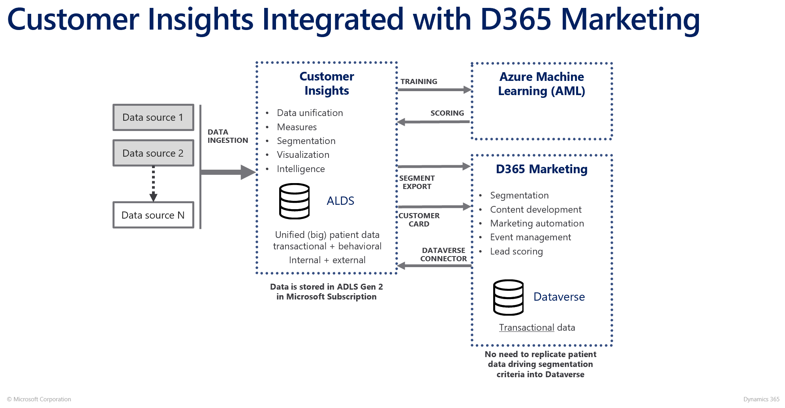
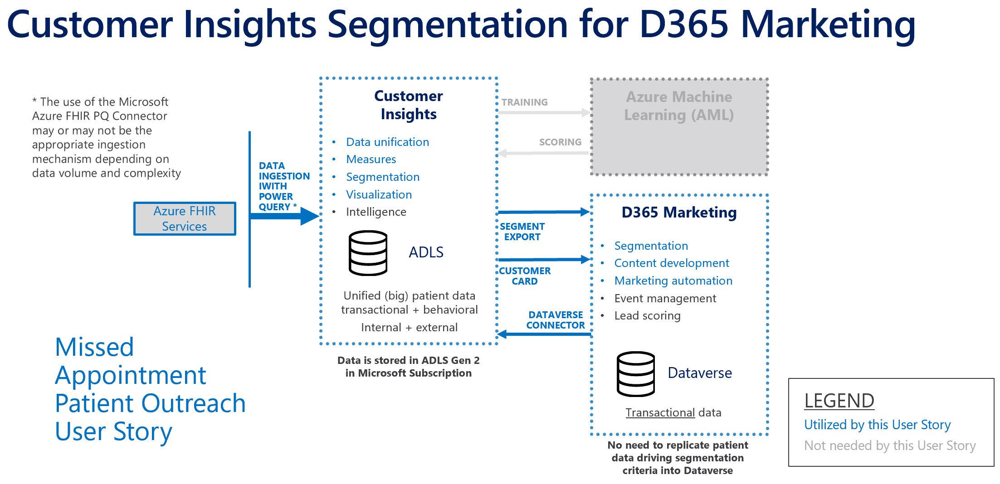

# Customer Insights Segmentation
> After reviewing this material, get hands on experience with: 
> * [Lab CI1: Ingest FHIR Data](./Lab_CI1)
> * [Lab CI2: Ingest Dataverse Data](./Lab_CI2)
> * [Lab CI3: Map, Match & Merge](./Lab_CI3)
> * [Lab CI4: Define Relationships & Activities](./Lab_CI4)
> * [Lab CI5: Define Patient Measures & Segments](./Lab_CI5)
>
> then continue to the next module: [Dynamics 365 Configuration](https://github.com/microsoft/MC4H-Acceleration/tree/main/PatientOutreach_UserStoryTraining/5_D365_Marketing_Config) 

## What is Customer Insights?

Customer Insights is the Microsoft offering of a fully managed customer data platform (CDP) as a service, currently including **Audience Insights** and **Engagement Insights** capabilities. 

### What is Audience Insights?

* Connect data from transactional, behavioral, and observational sources to create a unified and complete customer view
* Predict, Measure, Derive Insights, and Segment

> NOTE: This is the capability most referred to when discussing Customer Insights 

### What is Engagement Insights?

* Connect, measure and understand digital engagement (web) activity
* Digital engagement insights can be linked to Audience Insights to enrich your unified profiles

> NOTE: This capability is out of scope for this training

## Architecture

There are many potential architecture patterns with Customer Insights, inluding bring your own data lake (BYODL) + Synapse, using Power Query connectors for both import and export with On Premises or 3rd Party integrations, etc. 

For the purposes of this exercise, the best fit architecture is the standard **Dynamics 365 Integrated Reference Architecture**. 

As we focus in on the components of this architecture that will be required to implement the Missed Appointment Patient Outreach use case, we can adjust this architecture to fit our needs specifically. 

***
Complete the labs:
 * [Lab CI1: Ingest FHIR Data](./Lab_CI1/)
 * [Lab CI2: Ingest Dataverse Data](./Lab_CI2/)
 * [Lab CI3: Map, Match & Merge](./Lab_CI3/)
 * [Lab CI4: Define Relationships & Activities](./Lab_CI4)
 * [Lab CI5: Define Patient Measures & Segments](./Lab_CI5)

 Continue to the next module: [Dynamics 365 Configuration](https://github.com/microsoft/MC4H-Acceleration/tree/main/PatientOutreach_UserStoryTraining/5_D365_Marketing_Config) 

